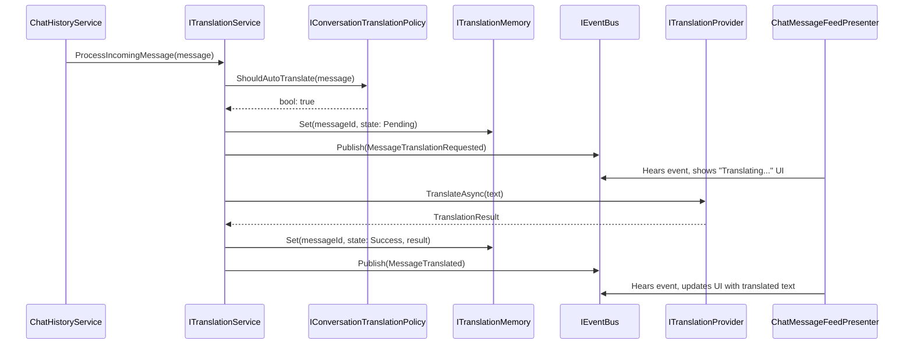

# Chat Translation Service Architecture

## 1. High-Level Overview

This document outlines the architecture for the in-game chat translation feature. The primary goal is to provide a robust, testable, and decoupled system for translating inbound chat messages while maintaining a responsive user experience.

The core design philosophy is **Separation of Concerns**, achieved through Dependency Injection and a service-oriented architecture. The translation feature is designed to be an independent module that the chat system can consume without being tightly coupled to its implementation details.

---

## 2. Core Architectural Principles (SOLID)

The system is built on the following principles:

-   **Single Responsibility Principle (SRP):** Each class has exactly one job (e.g., the `Provider` only translates, the `Policy` only decides, the `Service` only orchestrates).
-   **Open/Closed Principle:** The system is open for extension (e.g., we can add a new `ITranslationProvider` for a different backend) but closed for modification (we don't need to change `TranslationService` to do so).
-   **Dependency Inversion Principle:** All components depend on abstractions (`interfaces`) not on concrete implementations, allowing for easy testing and swappability.

---

## 3. Component Breakdown

| Component                         | Role              | Key Responsibilities                                                                                                        |
| --------------------------------- | ----------------- | --------------------------------------------------------------------------------------------------------------------------- |
| **`ITranslationService`**         | **Orchestrator**  | Coordinates all other components to fulfill a translation request. Manages the state lifecycle (`Pending` -> `Success`/`Failed`). |
| **`ITranslationProvider`**        | **Worker**        | The low-level adapter that communicates with a translation backend (e.g., a real API or the `MockTranslationProvider`).       |
| **`ITranslationMemory`**          | **State Store**   | The single source of truth for the *state* of a translation. Keeps translation data separate from `IChatHistory`.               |
| **`ITranslationCache`**           | **Speed Booster** | A short-term cache for translated text to prevent redundant API calls, saving cost and latency.                             |
| **`IConversationTranslationPolicy`** | **Gatekeeper**    | Makes the fast, synchronous decision on whether a message *should* be auto-translated based on a set of rules.              |
| **`ITranslationSettings`**        | **Rulebook**      | Provides all configuration data, such as the global kill-switch, user's language preference, and per-conversation toggles. |

---

## 4. Data Flow: Auto-Translating a Message

This sequence shows how an incoming message is processed from reception to final display.

---

## 5. Critical Workaround: The Client-Side `MessageId`

**Problem:** The translation system fundamentally requires a unique identifier for every message to track its state asynchronously. The backend (LiveKit) does not currently expose this ID to us.

**Solution (Temporary):**
1.  A `MessageId` field (`string`) has been added to the `ChatMessage` struct.
2.  The `ChatMessageFactory` now generates a `System.Guid.NewGuid().ToString()` for every incoming message.
3.  The `ChatHistorySerializer` has been updated to save and load this client-side ID to the local chat history files for persistence across sessions.

**Future Plan:**

When the backend is updated to provide the native LiveKit message ID, we will only need to change the `ChatMessageFactory` to use the backend ID instead of generating a new GUID. The rest of the system will continue to work without modification.

#### Phase 1: In-Memory, Per-Session IDs (Current Goal)

Since we are deferring the `ChatHistorySerializer` changes, all `MessageId`s will be generated on the client and will only exist for the current application session. This is perfectly acceptable for the initial implementation.

**How to Handle Outgoing Messages:**

This is a classic "optimistic update" scenario. The user expects to see their message in the chat feed *instantly*, not after a server round-trip.

1.  **Generate a Temporary ID:** When the user presses "Send," the `SendMessageCommand` (or a similar mechanism) will create the `ChatMessage` instance. At this moment, it will generate a **temporary, client-side GUID** for the `MessageId`.

2.  **Instant Local Update:** This `ChatMessage` with its temporary ID is immediately added to `IChatHistory`. The UI updates, and the user sees their message. The `TranslationService` can even start processing it for translation using this temporary ID.

3.  **Send to Backend:** The message is sent to the LiveKit backend.

4.  **Backend Acknowledgment (The "Ack"):** The backend will receive the message, process it, assign its own **permanent, official `MessageId`**, and then broadcast the message back to all clients in the channel, *including the original sender*.

5.  **The Reconciliation Problem:** The client now receives a message from the backend that is identical to the one it just sent, but with a different `MessageId`. How do we avoid showing a duplicate message?

    *   **Simple Solution (Recommended):** The `ChatHistoryService` (or wherever you process incoming messages) needs a simple check. If `message.IsSentByOwnUser` is true, you can check if there's already a recent message in the history with the same *body content*. If so, you can assume it's the "ack" for your optimistic message and simply ignore it, keeping your client-generated ID as the source of truth for this session.

    *   **Advanced Solution (For Later):** When the backend ID is available, you would create a mapping service (`Dictionary<string_tempId, string_permanentId>`). When the "ack" comes back, you'd find the optimistic message by its content, update its `MessageId` to the permanent one, and update the keys in your `ITranslationMemory`. For now, the simple solution is sufficient.

**Conclusion for this phase:** For now, **always generate a client-side GUID in your `ChatMessageFactory` for *all* messages (incoming and outgoing).** This provides a reliable, unique identifier for the duration of the session, which is all you need to get the translation feature working.

---

## 6. Configuration and Settings

All settings are managed through the `PlayerPrefsTranslationSettings` class, which reads from two sources:
-   **Global Kill Switch:** A feature flag named `chat_translation` controls whether the entire feature is active.
-   **User & Conversation Settings:** The user's preferred language and per-conversation auto-translate toggles are stored in `PlayerPrefs` using keys defined in `DCLPrefKeys`.

---

## 7. How to Test

To test the translation flow during development, use the `TranslationTester` component.

1.  Create an empty GameObject in a scene where the `ChatPlugin` is active.
2.  Attach the `TranslationTester.cs` script to it.
3.  Enter Play Mode.
4.  In the Inspector, right-click on the `TranslationTester` component's header to access the context menu.
5.  Use the menu options to send various test messages and observe the log output in the console.

Unit tests for the `ConversationTranslationPolicy` and `ToggleAutoTranslateCommand` are located in the project's Test folder.