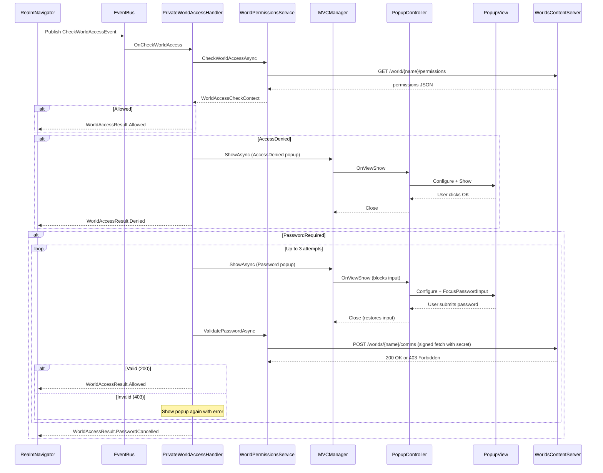

# Private Worlds

Access control for Decentraland Worlds that require passwords or invitation-only allow-lists.

## Overview

When a user navigates to a world, the system checks permissions **before** loading begins. Depending on the world's access configuration, the user may be:

- **Allowed in** immediately (unrestricted or on the allow-list)
- **Prompted for a password** (shared-secret worlds, up to 3 attempts)
- **Denied access** (invitation-only, not on the allow-list)

The feature is wired through `PrivateWorldsPlugin` and uses an event-driven architecture to keep navigation, permission checking, and UI decoupled.

## Architecture



## Key Components

### Plugin and Wiring

| File | Class | Role |
|------|-------|------|
| `PluginSystem/Global/PrivateWorldsPlugin.cs` | `PrivateWorldsPlugin` | Entry point. Subscribes handler to event bus, registers popup controller with MVC, spawns editor test trigger. |

### Core Logic

| File | Class | Role |
|------|-------|------|
| `PrivateWorldAccessHandler.cs` | `PrivateWorldAccessHandler` | Orchestrates the full flow: permission check, popup display, password validation retry loop. |
| `WorldPermissionsService.cs` | `WorldPermissionsService` | Calls backend APIs. Fetches permissions (`GET /world/{name}/permissions`), validates passwords (`POST /worlds/{name}/comms` via signed fetch). |
| `PrivateWorldEvents.cs` | `CheckWorldAccessEvent`, `WorldAccessResult` | Event struct published by `RealmNavigator`, consumed by handler. Result communicated back via `UniTaskCompletionSource`. |
| `WorldPermissionsData.cs` | `WorldAccessInfo`, `WorldAccessType` | Parsed permission data. Access types: `Unrestricted`, `AllowList`, `SharedSecret`. |

### UI (MVC)

| File | Class | Role |
|------|-------|------|
| `UI/PrivateWorldPopupController.cs` | `PrivateWorldPopupController` | MVC controller. Manages popup lifecycle, blocks game input while open, reads user result (password submitted or cancelled). |
| `UI/PrivateWorldPopupView.cs` | `PrivateWorldPopupView` | Unity UI view. Password input with visibility toggle, error outline, two modes (password / access denied). |
| `UI/PrivateWorldPopupParams.cs` | `PrivateWorldPopupParams` | Input/output data for the popup. Mode, world name, error message in; result and entered password out. |

### Integration Point

| File | Class | Role |
|------|-------|------|
| `RealmNavigation/RealmNavigator.cs` | `RealmNavigator` | Triggers access check before realm change. Publishes `CheckWorldAccessEvent`, awaits result, blocks world load if not `Allowed`. |

## Flow Detail

### 1. Navigation triggers access check

`RealmNavigator.TryChangeRealmAsync()` publishes a `CheckWorldAccessEvent` when `isWorld == true` and waits for the result before proceeding:

```csharp
var result = await PublishWorldAccessCheckAsync(realm, ct);
if (result != WorldAccessResult.Allowed)
    return MapToChangeRealmError(result);
// ... proceed to load the world
```

### 2. Handler checks permissions

`PrivateWorldAccessHandler` calls `WorldPermissionsService.CheckWorldAccessAsync()` which fetches the world's permission configuration from the backend and determines the access type:

- **Unrestricted** -- allowed immediately
- **SharedSecret** -- password required
- **AllowList** -- checks if the current wallet is on the list or is the owner

### 3. Password validation

For password-protected worlds, the handler runs a retry loop (max 3 attempts):

1. Shows the password popup via MVC
2. User enters password and submits (or cancels)
3. Calls `ValidatePasswordAsync()` which POSTs to `/worlds/{worldName}/comms` using [ADR-44 Signed Fetch](https://adr.decentraland.org/adr/ADR-44) with the password in the `secret` field of the auth chain metadata
4. Server returns **200** (correct password) or **403** (wrong password)
5. On failure, re-shows the popup with an error message

### 4. Input blocking

While the popup is visible, game input is blocked via `IInputBlock.Disable(InputMapComponent.BLOCK_USER_INPUT)` to prevent keyboard shortcuts (camera, movement, emotes, etc.) from firing while the user types. Input is restored on popup close.

## API Endpoints

| Method | Endpoint | Purpose |
|--------|----------|---------|
| `GET` | `/world/{world_name}/permissions` | Fetch world access configuration (unrestricted, allow-list, shared-secret) |
| `POST` | `/worlds/{worldName}/comms` | Validate password and get comms adapter. Password sent as `secret` in signed fetch metadata. Returns 200 + `fixedAdapter` on success, 403 on wrong password, 404 if world not found. |

Base URL: `https://worlds-content-server.decentraland.{ENV}`

See [Content Server API docs](https://docs.decentraland.org/apis/apis/worlds/content-server) for full specification.

## Enums

### WorldAccessType (permission configuration)

| Value | Meaning |
|-------|---------|
| `Unrestricted` | Anyone can enter |
| `AllowList` | Only wallets/communities on the list |
| `SharedSecret` | Password required |

### WorldAccessCheckResult (service result)

| Value | Meaning |
|-------|---------|
| `Allowed` | User has access |
| `PasswordRequired` | Must enter password |
| `AccessDenied` | Not on allow-list |
| `CheckFailed` | API call failed |

### WorldAccessResult (navigation result)

| Value | Meaning |
|-------|---------|
| `Allowed` | Proceed to load world |
| `Denied` | Invitation-only, not invited |
| `PasswordCancelled` | User cancelled or max attempts reached |
| `CheckFailed` | Permission check failed |

## How Users Can Enter a World

All paths that navigate to a world eventually call `RealmNavigator.TryChangeRealmAsync()`, which is where the access check runs. Here is every entry point:

### Direct UI actions

- **Places list "Jump In"** -- Clicking the Jump In button on place cards or the place detail panel (`PlacesCardSocialActionsController.JumpInPlace`)
- **Event detail "Jump In"** -- Clicking Jump In on event detail panels or community event cards (`EventDetailPanelController.OnJumpInButtonClicked`)
- **Friend "Jump In"** -- Clicking Jump In on a friend's profile or context menu when they are in a world (`FriendListSectionUtilities.JumpToFriendLocation`, `PassportController.OnJumpToFriendButtonClicked`)
- **Navmap panel "Jump In"** -- Clicking Jump In on the map place info or event info panels (sends `/goto` chat command via `NavmapBus`)
- **Event notification click** -- Clicking an "Event Started" notification (`NotificationHandler.EventStartSoonClicked`)

### Chat commands

- `/goto <realm>` or `/goto <realm> <x,y>` -- Navigates to a realm/world (`GoToChatCommand`)
- `/world <world>` or `/world <world> <x,y>` -- Navigates to a world (`WorldChatCommand`)
- `/goto <x,y>` -- Teleports within Genesis City (does not trigger world access check)

### Deep links

- `decentraland://` URLs with `realm` parameter -- Handled by `DeepLinkHandleImplementation`, calls `ChatTeleporter.TeleportToRealmAsync()`

### SDK scene actions

- `changeRealm()` from scene SDK -- Shows a `ChangeRealmPromptController` confirmation dialog, then sends `/goto` chat command
- `movePlayerTo()` from scene SDK -- Shows a `TeleportPromptController` confirmation dialog for parcel teleports

### Text hyperlinks

- Clicking world/scene links in chat or UI text -- `TextHyperlinkHandlerElement.HandleWorldLink()` shows a change realm prompt

### Debug

- Debug widget teleport buttons in `RealmContainer` (parcel and spawn point teleports)

All of these paths converge on `RealmNavigator.TryChangeRealmAsync()` (directly or via `ChatTeleporter`), which publishes `CheckWorldAccessEvent` and waits for the result before loading the world.

## Testing

In the Unity Editor, a `[DEBUG] PrivateWorldsTestTrigger` GameObject is spawned automatically. Use its context menu options in the Inspector:

- **Test - Check World Access** -- runs the full permissions check
- **Test - Validate Password (Wrong)** -- sends a wrong password to the comms endpoint
- **Test - Validate Password (Correct)** -- sends a correct password
- **Test - Show Password Required Popup** -- opens the password popup
- **Test - Show Access Denied Popup** -- opens the access denied popup

Default test values (zone environment):

- `testWorldName`: `yourname.dcl.eth`
- `testWrongPassword`: `wrong`
- `testCorrectPassword`: `abc123`

These can be changed in the Inspector fields on the `[DEBUG] PrivateWorldsTestTrigger` GameObject.

## Mock / Fallback Behavior

When the permissions API is unavailable or for local testing, `WorldPermissionsService` falls back to name-based mocks:

- World names containing `password` or `secret` → password required
- World names containing `invite`, `private`, or `whitelist` → invitation only
- `mirko.dcl.eth` → randomly password or invitation (for testing both flows)
- All others → unrestricted
