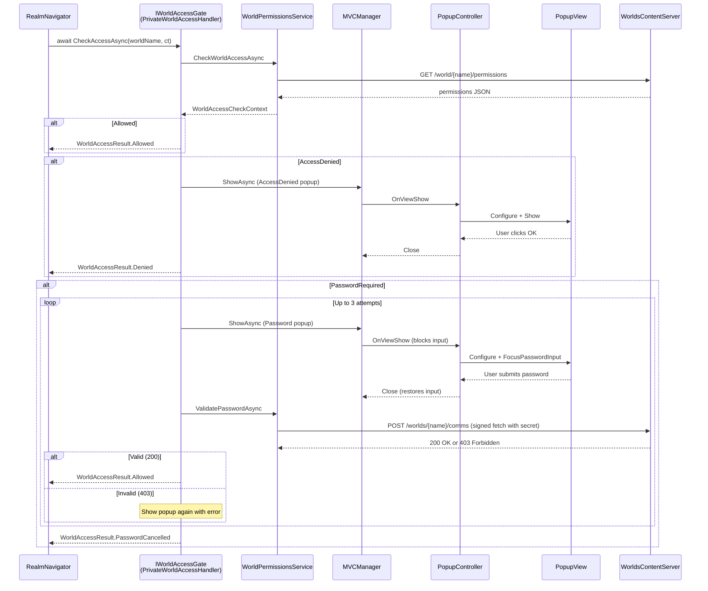
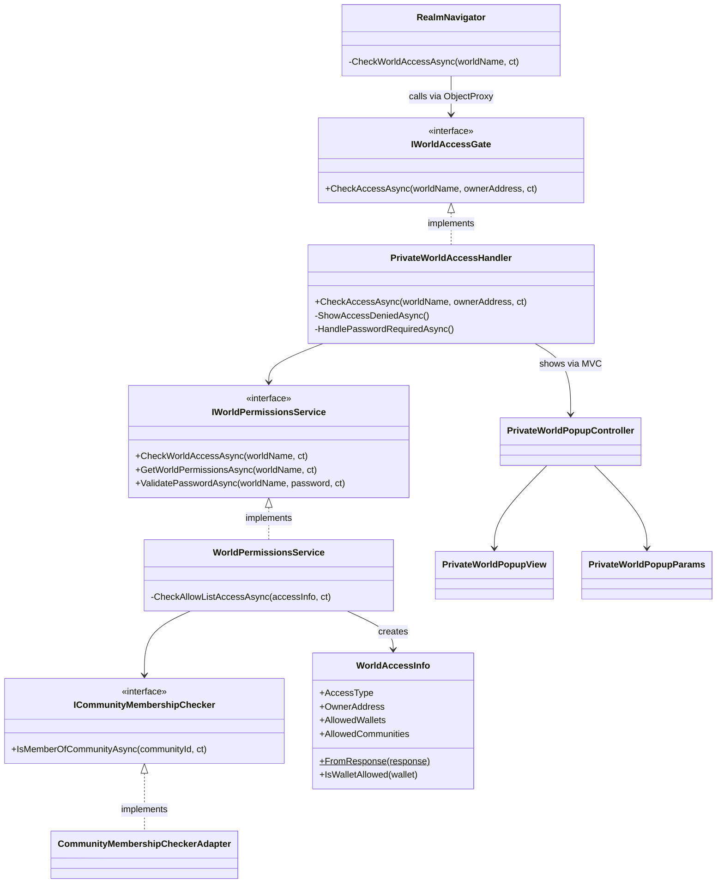

# Private Worlds

Access control for Decentraland Worlds that require passwords or invitation-only allow-lists.

## Overview

When a user navigates to a world, the system checks permissions **before** loading begins. Depending on the world's access configuration, the user may be:

- **Allowed in** immediately (unrestricted or on the allow-list)
- **Prompted for a password** (shared-secret worlds, up to 3 attempts)
- **Denied access** (invitation-only, not on the allow-list)

The feature uses a direct `IWorldAccessGate` interface — `RealmNavigator` awaits the gate, the gate runs permissions and shows popups, and returns a result. No event bus, no fire-and-forget.

## Architecture



## Component Map



## Key Components

### Plugin and Wiring

| File | Class | Role |
|------|-------|------|
| `PluginSystem/Global/PrivateWorldsPlugin.cs` | `PrivateWorldsPlugin` | Registers popup controller with MVC, spawns editor test trigger. |
| `Infrastructure/Global/Dynamic/DynamicWorldContainer.cs` | `DynamicWorldContainer` | Creates `PrivateWorldAccessHandler` and sets it on `RealmNavigator`'s `ObjectProxy<IWorldAccessGate>`. |

### Core Logic

| File | Class | Role |
|------|-------|------|
| `PrivateWorldAccessHandler.cs` | `PrivateWorldAccessHandler` | Implements `IWorldAccessGate`. Orchestrates the full flow: permission check, popup display, password validation retry loop. |
| `WorldPermissionsService.cs` | `WorldPermissionsService` | Calls backend APIs. Fetches permissions (`GET`), validates passwords (`POST` via signed fetch). Checks allow-list wallets, owner, and community membership. |
| `PrivateWorldEvents.cs` | `IWorldAccessGate`, `WorldAccessResult` | Interface for the access gate. Result enum returned to `RealmNavigator`. |
| `WorldPermissionsData.cs` | `WorldAccessInfo`, `WorldAccessType` | Parsed permission data. Access types: `Unrestricted`, `AllowList`, `SharedSecret`. |

### UI (MVC)

| File | Class | Role |
|------|-------|------|
| `UI/PrivateWorldPopupController.cs` | `PrivateWorldPopupController` | MVC controller. Manages popup lifecycle, blocks game input while open, reads user result (password submitted or cancelled). |
| `UI/PrivateWorldPopupView.cs` | `PrivateWorldPopupView` | Unity UI view. Password input with visibility toggle, error outline, two modes (password / access denied). |
| `UI/PrivateWorldPopupParams.cs` | `PrivateWorldPopupParams` | Input/output data for the popup. Mode, world name, error message in; result and entered password out. |

### Integration Point

| File | Class | Role |
|------|-------|------|
| `RealmNavigation/RealmNavigator.cs` | `RealmNavigator` | Triggers access check before realm change. Calls `IWorldAccessGate.CheckAccessAsync` via `ObjectProxy`, applies 15s timeout, blocks world load if not `Allowed`. |

## Flow Detail

### 1. Navigation triggers access check

`RealmNavigator.TryChangeRealmAsync()` calls the gate directly when `worldName` is provided:

```csharp
var result = await CheckWorldAccessAsync(worldName, ct);
if (result != WorldAccessResult.Allowed)
    return MapToChangeRealmError(result);
// ... proceed to load the world
```

The `CheckWorldAccessAsync` method applies a 15-second timeout via linked `CancellationTokenSource`. If the gate hangs (e.g., network issue), the navigator catches `OperationCanceledException` and distinguishes caller cancellation from timeout.

### 2. Handler checks permissions

`PrivateWorldAccessHandler.CheckAccessAsync()` calls `WorldPermissionsService.CheckWorldAccessAsync()` which fetches the world's permission configuration from the backend and determines the access type:

- **Unrestricted** -- allowed immediately
- **SharedSecret** -- password required
- **AllowList** -- checks wallet, owner, then community membership

### 3. Allow-list check

`WorldPermissionsService.CheckAllowListAccessAsync` checks in order:

1. Is the user's wallet in the `AllowedWallets` list? (case-insensitive)
2. Is the user's wallet the world owner?
3. Is the user a member of any `AllowedCommunities`? (via `ICommunityMembershipChecker`)

If any check passes, access is granted. Community checks that throw exceptions are logged and skipped (other communities are still checked).

### 4. Password validation

For password-protected worlds, the handler runs a retry loop (max 3 attempts):

1. Minimizes chat (via `beforePopupShown` callback) to prevent input focus conflicts
2. Shows the password popup via MVC
3. User enters password and submits (or cancels)
4. Calls `ValidatePasswordAsync()` which POSTs to `/worlds/{worldName}/comms` using [ADR-44 Signed Fetch](https://adr.decentraland.org/adr/ADR-44) with the password in the `secret` field of the auth chain metadata
5. Server returns **200** (correct password) or **403** (wrong password)
6. On failure, re-shows the popup with an error message

### 5. Input blocking

While the popup is visible, game input is blocked via `IInputBlock.Disable(InputMapComponent.BLOCK_USER_INPUT)` to prevent keyboard shortcuts (camera, movement, emotes, etc.) from firing while the user types. Input is restored on popup close.

## API Endpoints

| Method | Endpoint | Purpose |
|--------|----------|---------|
| `GET` | `/world/{world_name}/permissions` | Fetch world access configuration (unrestricted, allow-list, shared-secret) |
| `POST` | `/worlds/{worldName}/comms` | Validate password and get comms adapter. Password sent as `secret` in signed fetch metadata. Returns 200 + `fixedAdapter` on success, 403 on wrong password, 404 if world not found. |

Base URL: `https://worlds-content-server.decentraland.{ENV}`

See [Content Server API docs](https://docs.decentraland.org/apis/apis/worlds/content-server) for full specification.

## Enums

### WorldAccessType (permission configuration)

| Value | Meaning |
|-------|---------|
| `Unrestricted` | Anyone can enter |
| `AllowList` | Only wallets/communities on the list |
| `SharedSecret` | Password required |

### WorldAccessCheckResult (service result)

| Value | Meaning |
|-------|---------|
| `Allowed` | User has access |
| `PasswordRequired` | Must enter password |
| `AccessDenied` | Not on allow-list |
| `CheckFailed` | API call failed |

### WorldAccessResult (navigation result)

| Value | Meaning |
|-------|---------|
| `Allowed` | Proceed to load world |
| `Denied` | Invitation-only, not invited |
| `PasswordCancelled` | User cancelled or max attempts reached |
| `CheckFailed` | Permission check failed |

## How Users Can Enter a World

All paths that navigate to a world eventually call `RealmNavigator.TryChangeRealmAsync()`, which is where the access check runs. Here is every entry point:

### Direct UI actions

- **Places list "Jump In"** -- Clicking the Jump In button on place cards or the place detail panel (`PlacesCardSocialActionsController.JumpInPlace`)
- **Event detail "Jump In"** -- Clicking Jump In on event detail panels or community event cards (`EventDetailPanelController.OnJumpInButtonClicked`)
- **Friend "Jump In"** -- Clicking Jump In on a friend's profile or context menu when they are in a world (`FriendListSectionUtilities.JumpToFriendLocation`, `PassportController.OnJumpToFriendButtonClicked`)
- **Navmap panel "Jump In"** -- Clicking Jump In on the map place info or event info panels (sends `/goto` chat command via `NavmapBus`)
- **Event notification click** -- Clicking an "Event Started" notification (`NotificationHandler.EventStartSoonClicked`)

### Chat commands

- `/goto <realm>` or `/goto <realm> <x,y>` -- Navigates to a realm/world (`GoToChatCommand`)
- `/world <world>` or `/world <world> <x,y>` -- Navigates to a world (`WorldChatCommand`)
- `/goto <x,y>` -- Teleports within Genesis City (does not trigger world access check)

### Deep links

- `decentraland://` URLs with `realm` parameter -- Handled by `DeepLinkHandleImplementation`, calls `ChatTeleporter.TeleportToRealmAsync()`

### SDK scene actions

- `changeRealm()` from scene SDK -- Shows a `ChangeRealmPromptController` confirmation dialog, then sends `/goto` chat command
- `movePlayerTo()` from scene SDK -- Shows a `TeleportPromptController` confirmation dialog for parcel teleports

### Text hyperlinks

- Clicking world/scene links in chat or UI text -- `TextHyperlinkHandlerElement.HandleWorldLink()` shows a change realm prompt

### Debug

- Debug widget teleport buttons in `RealmContainer` (parcel and spawn point teleports)

All of these paths converge on `RealmNavigator.TryChangeRealmAsync()` (directly or via `ChatTeleporter`), which calls `IWorldAccessGate.CheckAccessAsync` and waits for the result before loading the world.

## Testing

### Unit Tests (Tests/EditMode)

| File | Tests | What it covers |
|------|-------|----------------|
| `WorldAccessInfoShould.cs` | 13 | `FromResponse` parsing (all access types, case sensitivity, null handling) and `IsWalletAllowed` (case-insensitive matching, empty/null) |
| `WorldPermissionsServiceShould.cs` | 10 | Routing (unrestricted/secret/null), allow-list wallet/owner checks, community membership (match, no match, error resilience, null checker) |
| `PrivateWorldAccessHandlerShould.cs` | 8 | Gate implementation: switch cases, password popup + retry loop, cancellation propagation, exception handling |
| `RealmNavigatorPrivateWorldsShould.cs` | 6 | Navigator integration: result-to-error mapping, skip when worldName is null, 15s timeout |

### Editor Test Trigger

In the Unity Editor, a `[DEBUG] PrivateWorldsTestTrigger` GameObject is spawned automatically. Use its context menu options in the Inspector:

- **Test - Fetch World Permissions** -- raw API call to GET permissions
- **Test - Check World Access (Raw)** -- runs `CheckWorldAccessAsync` on the service
- **Test - Validate Password (Wrong/Correct)** -- sends passwords to the comms endpoint
- **Test - Show Password Required Popup** -- opens the password popup
- **Test - Show Access Denied Popup** -- opens the access denied popup
- **Test - Gate: Full Access Flow** -- runs the full `IWorldAccessGate.CheckAccessAsync` flow
- **Test - Simulate CheckFailed Toast** -- triggers the notification toast

Default test values (zone environment):

- `testWorldName`: `yourname.dcl.eth`
- `testWrongPassword`: `wrong`
- `testCorrectPassword`: `abc123`

These can be changed in the Inspector fields on the `[DEBUG] PrivateWorldsTestTrigger` GameObject.
