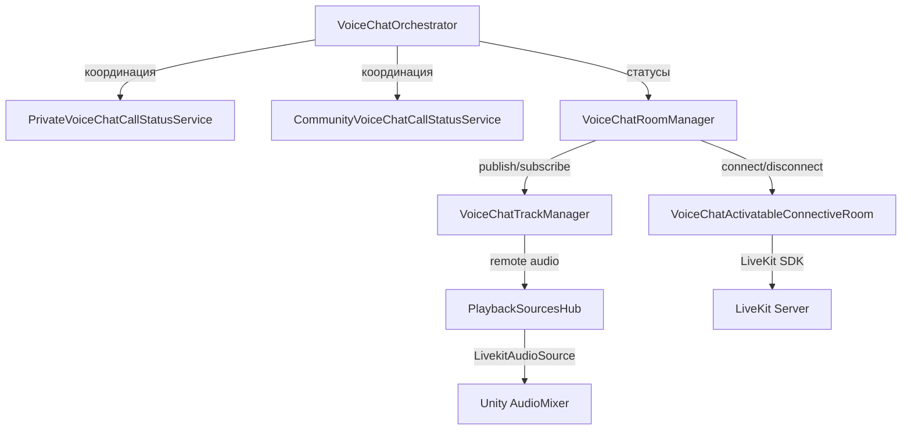

# ADR: Proximity (Spatial Nearby) Voice Chat

**Status:** Accepted (prototype phase)  
**Date:** 2026-03-02  
**Authors:** Voice Chat team

---

## Context

Decentraland Explorer имеет два типа voice chat: Private (1-на-1) и Community (групповой). Оба требуют явного действия пользователя для подключения и координируются через BE (Social Service RPC).

Нужен третий тип -- **Proximity Voice Chat** (Spatial Nearby), который:
- Включён по умолчанию (автоматическое подключение)
- Охватывает игроков, находящихся рядом (на одном Island)
- В финальной версии использует 3D audio (spatial AudioSource), привязанный к позиции аватара

---

## Существующая архитектура Voice Chat

### Общая структура



### Ключевые принципы

1. **VoiceChatOrchestrator** -- FSM-координатор; решает что делать при любом voice-событии
2. **CallStatusService** -- для каждого типа звонка свой; наследуется от `IVoiceChatCallStatusServiceBase`; общается с BE через `RPCSocialServiceBase`
3. **VoiceChatRoomManager** -- универсальный; одна voice-комната на все типы звонков
4. **PlaybackSourcesHub** -- `ConcurrentDictionary<StreamKey, (AudioStream, LivekitAudioSource)>`; один AudioSource на участника; все в одном `AudioMixerGroup`; Unity сам микширует
5. **LivekitAudioSource** -- из LiveKit SDK; MonoBehaviour с AudioSource; получает аудио из `AudioStream`
6. Вся низкоуровневая обработка (WebRTC, AGC, шумоподавление, буферизация) -- внутри LiveKit SDK

### Rooms

| Room | Назначение | Connection String |
|------|-----------|-------------------|
| Island Room | Участники по близости (позиция) | От Archipelago сервера |
| Scene Room | Участники в текущей сцене | GateKeeper adapter |
| Chat Room | Глобальный чат | Chat adapter |
| Voice Chat Room | Голосовой чат (Private/Community) | Social Service RPC |

Voice Chat Room создаётся отдельно и активируется только при звонке. Island Room всегда активен.

### Маппинг участников на Entity

`EntityParticipantTable` (walletId -> Entity) позволяет получить ECS-сущность для любого участника. Через Entity доступен Transform для позиционирования AudioSource.

---

## Decision

### Итерация 1: Публикация аудио в Island Room (Вариант A)

**Решение:** Использовать существующий Island Room для proximity voice chat. Каждый участник публикует свой аудио-трек прямо в Island Room и подписывается на аудио-треки других участников.

**Обоснование:**
- Island Room уже содержит нужных участников (по proximity)
- `IRoom` полностью поддерживает audio tracks (`AudioStreams`, `AudioTracks`, `PublishTrack`)
- Не требуется новая комната, новый connection string, BE-координация
- **Проверено:** LiveKit-сервер разрешает публикацию аудио-треков в Island Room (тест пройден)

**Альтернативы рассмотрены:**

| Вариант | Описание | Причина отказа |
|---------|----------|----------------|
| B: Вторая комната с тем же connection string | Изоляция аудио от data | `DuplicateIdentity` disconnect; сложнее |
| C: Новый серверный endpoint | Отдельная LiveKit-комната для proximity | Требует BE; overkill для прототипа |

### Итерация 2: 3D Spatial Audio (реализовано)

**Решение:** ECS-система + shared dictionary как мост между LiveKit-менеджером и ECS-миром.

- `AudioSource.spatialBlend = 1.0f`, `minDistance = 2f`, `maxDistance = 16f`, `rolloffMode = Custom` (с `ProximityCustomRolloffCurve`)
- `VoiceChatPlugin` владеет `ConcurrentDictionary<string, AudioSource>` (walletId → AudioSource)
- `ProximityVoiceChatManager` пишет в словарь при subscribe/unsubscribe треков (не трогает World напрямую)
- `ProximityAudioPositionSystem` (ECS, `PresentationSystemGroup`, after `MultiplayerProfilesSystem`):
  - Каждый кадр итерирует словарь, резолвит entity через `EntityParticipantTable`
  - Если entity существует и нет компонента → `world.Add(entity, ProximityAudioSourceComponent)`
  - Синхронизирует `AudioSource.position = CharacterTransform.Position`
  - Детектит destroyed Transform (null) → `world.Remove<ProximityAudioSourceComponent>`

**Обоснование выбора shared dictionary вместо прямого `world.Add` в менеджере:**
- Entity может не существовать на момент `OnTrackSubscribed` (LiveKit-событие приходит раньше создания entity)
- Система retry каждый кадр через `entityParticipantTable.TryGet()` — привяжет когда entity появится
- Менеджер полностью развязан от ECS World — чище разделение ответственности

### Итерация 3: Полноценная интеграция (реализовано)

Реализованы все ключевые фичи:
- Координация с Private/Community: `ProximityVoiceChatStateModel` с состояниями Disconnected/Hearing/Speaking/Blocked, `Suppress()/Resume()` при активном звонке
- Mute/Unmute + Push-to-Talk: UI через `NearbyVoiceWidgetController`, PTT через DCLInput
- Nametag speaking indicator: `ProximityNametagsHandler` → `VoiceChatNametagComponent`
- Mute persistence: `ProximityMuteService` + `RestProximityMuteRepository` (API) + `ProximityMuteCache`
- Lip sync: `ProximityLipSyncSystem` с AmplitudeWeighted/SpeechBandAmplitude/FrequencyBands режимами
- Audio Effect Zones (silence, reverb, echo, filter)
- Смена микрофона в рантайме: подписка на `VoiceChatSettings.MicrophoneChanged`
- macOS permissions guard: `VoiceChatPermissions.GuardAsync` перед публикацией
- Reconnection retry: `ActivateWithRetryAsync` с `MaxReconnectionAttempts`
- Lazy track publishing: публикация при первом Speaking, не при Hearing (см. `ADR_lazy_track_publishing.md`)
- Debug widget: `ProximityAudioDebugWidget` с runtime-слайдерами
- UI: `ProximityVoiceChatButtonController` (sidebar) + `NearbyVoiceWidgetController` (panel с volume, hear toggle, speak button)

---

## Technical Details

### ProximityVoiceChatManager

```
ProximityVoiceChatManager : IDisposable
├── IRoom islandRoom (из roomHub.IslandRoom())
├── VoiceChatConfiguration configuration
├── ConcurrentDictionary<string, AudioSource> activeAudioSources (shared, от Plugin)
├── ConcurrentDictionary<StreamKey, LivekitAudioSource> remoteSources (internal)
├── ProximityMuteService proximityMuteService
├── ProximityVoiceChatStateModel stateModel
├── MicrophoneRtcAudioSource? rtcAudioSource (локальный микрофон)
├── ITrack? localTrack (локальный аудио-трек)
├── LivekitAudioSource? loopbackSource (опциональный self-playback)
├── bool published, disposed, suppressed
│
├── OnConnectionUpdated()
│   ├── Connected → ActivateWithRetryAsync() → SubscribeToExistingRemoteTracks()
│   └── Disconnected → Deactivate()
│
├── OnProximityStateChanged()
│   ├── Speaking (first) → PublishLocalTrackAsync()
│   ├── Speaking (subsequent) → rtcAudioSource.Start()
│   ├── Hearing → rtcAudioSource.Stop()
│   └── Blocked → SuppressProximity()
│
├── OnTrackSubscribed() → AddRemoteSource() → activeAudioSources[walletId] = audioSource
├── OnTrackUnsubscribed() → RemoveRemoteSource() → activeAudioSources.TryRemove(walletId)
├── OnCallStatusChanged() → Suppress/Resume при Private/Community
├── OnMicrophoneChanged() → rtcAudioSource.SwitchMicrophone()
└── OnMuteStateChanged() → mute/unmute отдельных remote AudioSources
```

### ProximityAudioPositionSystem (ECS)

```
ProximityAudioPositionSystem : BaseUnityLoopSystem
├── [UpdateInGroup(PresentationSystemGroup)]
├── [UpdateAfter(MultiplayerProfilesSystem)]
│
├── Update(float t)
│   ├── AssignPendingSources()     — iterate activeAudioSources → entityParticipantTable → world.Add
│   ├── SyncPositionsQuery(World)  — AudioSource.position = cameraPos + (remoteHeadPos - localHeadPos)
│   ├── ApplySettingsQuery(World)  — VoiceChatConfiguration → AudioSource settings каждый кадр
│   └── ProcessCleanUp()           — null Transform → world.Remove<ProximityAudioSourceComponent>
│
└── Dependencies:
    ├── IReadOnlyEntityParticipantTable
    ├── ConcurrentDictionary<string, AudioSource> (shared)
    └── ProximityConfigHolder
```

### ProximityAudioSourceComponent (ECS)

```csharp
public struct ProximityAudioSourceComponent
{
    public Transform AudioSourceTransform;
    public AudioSource AudioSource;

    public ProximityAudioSourceComponent(AudioSource audioSource);
}
```

### Подключение в DI

`VoiceChatPlugin` владеет shared-словарём `ConcurrentDictionary<string, AudioSource>`:
- `InjectToWorld()` передаёт его в `ProximityAudioPositionSystem` и `ProximityLipSyncSystem` (вместе с `entityParticipantTable` и `ProximityConfigHolder`)
- `InitializeAsync()` передаёт его в `ProximityVoiceChatManager`
- `ProximityConfigHolder` — late-bound holder для `VoiceChatConfiguration`, `Texture2DArray` (lip sync) и `HashSet<string>` (speaking participants)
- `ProximityNametagsHandler` создаётся после получения `identityCache.Identity`

### Моно-сигнал и стерео-буфер

**Голосовой трафик LiveKit — моно.** Полный путь аудио:

```
Микрофон (1-2 ch) → WebRTC APM (моно) → Opus VOIP (моно) → сеть → Opus decoder (моно)
```

- WebRTC Audio Processing Module (AGC, шумоподавление, эхоподавление) работает в моно
- Opus кодек в режиме `OPUS_APPLICATION_VOIP` кодирует голос в моно независимо от входа
- На принимающей стороне декодированный поток — всегда 1 канал

**`AudioStream` запрашивает 2 канала** (`currentChannels = 2` в конструкторе), потому что Unity
вызывает `OnAudioFilterRead(float[] data, int channels)` со стерео-буфером (`channels = 2`,
определяется `AudioSettings.speakerMode`). Буфер интерлейсный: `[L0, R0, L1, R1, ...]`.
Если бы мы запросили моно, нативный слой вернул бы 1 сэмпл на фрейм, а Unity ожидает 2 —
данные бы не совпали по размеру и формату.

Нативный слой LiveKit при upmix моно → стерео **дублирует** единственный канал в оба:
`channel[0] == channel[1]` для каждого сэмпла. Поэтому `ApplySpatializationPipeline` корректно
берёт только `data[i * channels]` (канал 0) как моно-источник — он идентичен каналу 1.

Затем spatialization (ILD, ITD, Head Shadow, HRTF) создаёт из этого моно настоящее стерео
с пространственной информацией. Это акустически правильно: 3D-точечный источник (голова
другого игрока) по определению моно.

### Нормализация аудио

Кастомной нормализации нет. Используется:
- Компенсация Windows vs Mac: `Microphone_Volume = 13` dB на Windows
- Пользовательский слайдер: `VoiceChat_Volume` в AudioMixer (percentage → dB)
- AGC/шумоподавление: внутри LiveKit SDK (WebRTC APM)

### Thread Safety

Callbacks от LiveKit приходят не с main thread. Используется `await UniTask.SwitchToMainThread()`. Shared-словарь — `ConcurrentDictionary` для безопасности на стыке callback/system.

---

## Consequences

### Positive

- Минимальное количество изменений для прототипа
- Переиспользование существующей инфраструктуры Island Room
- Не ломает существующий voice chat (Private/Community)
- Автоматическое подключение/отключение (следует за Island lifecycle)
- Island Room сам управляет reconnection

### Negative / Risks

- Аудио-треки идут в тот же Room что и data (movement, profiles) -- увеличенный трафик
- Нет изоляции: проблемы в Island Room затронут и proximity voice
- ~~В текущей итерации нет координации с Private/Community -- могут работать одновременно~~ → Решено: Suppress/Resume через `ProximityVoiceChatStateModel`
- Permissions на publish могут измениться на сервере

### Future Considerations

- При масштабировании может потребоваться отдельная комната для аудио
- ~~Нужен механизм mute/unmute отдельных участников~~ → Решено: `ProximityMuteService` с REST API persistence
- Настройки качества аудио (bitrate) для proximity могут отличаться от Private/Community
- ~~Настройки spatial audio (`minDistance`, `maxDistance`, `rolloffMode`) могут быть вынесены в `VoiceChatConfiguration`~~ → Решено: все настройки в `VoiceChatConfiguration` ScriptableObject + `ProximityAudioDebugWidget` для runtime-тюнинга
