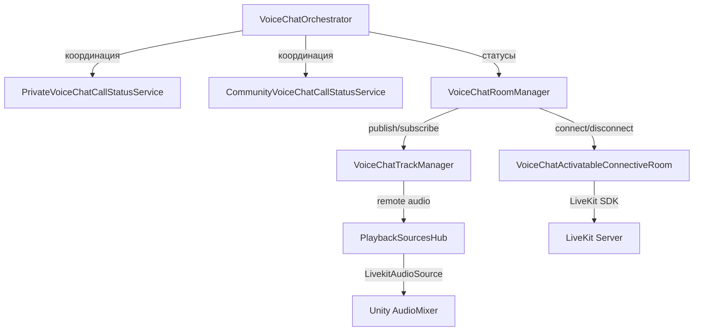

# ADR: Proximity (Spatial Nearby) Voice Chat

**Status:** Accepted (prototype phase)  
**Date:** 2026-03-02  
**Authors:** Voice Chat team

---

## Context

Decentraland Explorer имеет два типа voice chat: Private (1-на-1) и Community (групповой). Оба требуют явного действия пользователя для подключения и координируются через BE (Social Service RPC).

Нужен третий тип -- **Proximity Voice Chat** (Spatial Nearby), который:
- Включён по умолчанию (автоматическое подключение)
- Охватывает игроков, находящихся рядом (на одном Island)
- В финальной версии использует 3D audio (spatial AudioSource), привязанный к позиции аватара

---

## Существующая архитектура Voice Chat

### Общая структура



### Ключевые принципы

1. **VoiceChatOrchestrator** -- FSM-координатор; решает что делать при любом voice-событии
2. **CallStatusService** -- для каждого типа звонка свой; наследуется от `IVoiceChatCallStatusServiceBase`; общается с BE через `RPCSocialServiceBase`
3. **VoiceChatRoomManager** -- универсальный; одна voice-комната на все типы звонков
4. **PlaybackSourcesHub** -- `ConcurrentDictionary<StreamKey, (AudioStream, LivekitAudioSource)>`; один AudioSource на участника; все в одном `AudioMixerGroup`; Unity сам микширует
5. **LivekitAudioSource** -- из LiveKit SDK; MonoBehaviour с AudioSource; получает аудио из `AudioStream`
6. Вся низкоуровневая обработка (WebRTC, AGC, шумоподавление, буферизация) -- внутри LiveKit SDK

### Rooms

| Room | Назначение | Connection String |
|------|-----------|-------------------|
| Island Room | Участники по близости (позиция) | От Archipelago сервера |
| Scene Room | Участники в текущей сцене | GateKeeper adapter |
| Chat Room | Глобальный чат | Chat adapter |
| Voice Chat Room | Голосовой чат (Private/Community) | Social Service RPC |

Voice Chat Room создаётся отдельно и активируется только при звонке. Island Room всегда активен.

### Маппинг участников на Entity

`EntityParticipantTable` (walletId -> Entity) позволяет получить ECS-сущность для любого участника. Через Entity доступен Transform для позиционирования AudioSource.

---

## Decision

### Итерация 1: Публикация аудио в Island Room (Вариант A)

**Решение:** Использовать существующий Island Room для proximity voice chat. Каждый участник публикует свой аудио-трек прямо в Island Room и подписывается на аудио-треки других участников.

**Обоснование:**
- Island Room уже содержит нужных участников (по proximity)
- `IRoom` полностью поддерживает audio tracks (`AudioStreams`, `AudioTracks`, `PublishTrack`)
- Не требуется новая комната, новый connection string, BE-координация
- **Проверено:** LiveKit-сервер разрешает публикацию аудио-треков в Island Room (тест пройден)

**Альтернативы рассмотрены:**

| Вариант | Описание | Причина отказа |
|---------|----------|----------------|
| B: Вторая комната с тем же connection string | Изоляция аудио от data | `DuplicateIdentity` disconnect; сложнее |
| C: Новый серверный endpoint | Отдельная LiveKit-комната для proximity | Требует BE; overkill для прототипа |

### Итерация 2: 3D Spatial Audio (планируется)

- `AudioSource.spatialBlend = 1.0f`
- `minDistance` / `maxDistance` / `rolloffMode` настраиваемые
- Позиция AudioSource обновляется каждый кадр по позиции аватара через `EntityParticipantTable`
- Потребуется ECS-система для обновления позиций (аналогично `NametagPlacementSystem`)

### Итерация 3: Интеграция с Orchestrator (планируется)

- `VoiceChatType.SPATIAL` в enum
- Координация: mute/pause spatial при Private/Community звонке
- UI: toggle для включения/выключения

---

## Technical Details

### Новый класс: ProximityVoiceChatManager

```
ProximityVoiceChatManager
├── IRoom islandRoom (из roomHub.IslandRoom())
├── PlaybackSourcesHub (свой экземпляр)
├── MicrophoneRtcAudioSource (локальный микрофон)
├── ITrack (локальный аудио-трек)
│
├── OnConnectionUpdated()
│   ├── Connected → PublishLocalTrack() + StartListeningToRemoteTracks()
│   └── Disconnected → Cleanup()
│
├── OnTrackSubscribed() → playbackSourcesHub.AddOrReplaceStream()
└── OnTrackUnsubscribed() → playbackSourcesHub.RemoveStream()
```

### Подключение в DI

`VoiceChatPlugin.InitializeAsync()` создаёт `ProximityVoiceChatManager` и добавляет в `pluginScope`.

### Нормализация аудио

Кастомной нормализации нет. Используется:
- Компенсация Windows vs Mac: `Microphone_Volume = 13` dB на Windows
- Пользовательский слайдер: `VoiceChat_Volume` в AudioMixer (percentage → dB)
- AGC/шумоподавление: внутри LiveKit SDK (WebRTC APM)

### Thread Safety

Callbacks от LiveKit приходят не с main thread. Используется `await UniTask.SwitchToMainThread()`. `PlaybackSourcesHub` использует `ConcurrentDictionary`.

---

## Consequences

### Positive

- Минимальное количество изменений для прототипа
- Переиспользование существующей инфраструктуры Island Room
- Не ломает существующий voice chat (Private/Community)
- Автоматическое подключение/отключение (следует за Island lifecycle)
- Island Room сам управляет reconnection

### Negative / Risks

- Аудио-треки идут в тот же Room что и data (movement, profiles) -- увеличенный трафик
- Нет изоляции: проблемы в Island Room затронут и proximity voice
- В текущей итерации нет координации с Private/Community -- могут работать одновременно
- Permissions на publish могут измениться на сервере

### Future Considerations

- При масштабировании может потребоваться отдельная комната для аудио
- Нужен механизм mute/unmute отдельных участников
- Spatial audio потребует частого обновления позиций AudioSource
- Настройки качества аудио (bitrate) для proximity могут отличаться от Private/Community
