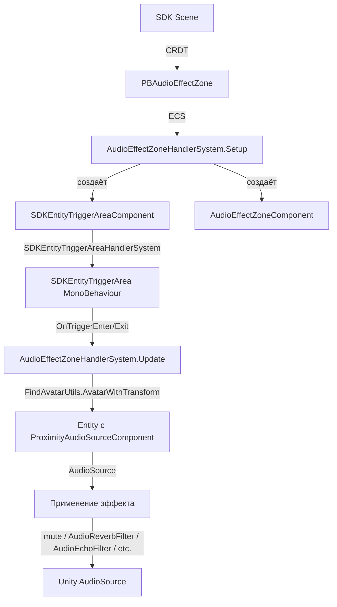

# ADR: Audio Effect Zones

**Status:** Accepted (design phase)
**Date:** 2026-03-13
**Updated:** 2026-03-13 (ID fix, nested types, forward-compat path)
**Authors:** Voice Chat team

---

## Context

Decentraland Explorer поддерживает Proximity Voice Chat (spatial audio, привязанный к аватарам через Island Room). Следующий шаг -- дать разработчикам сцен возможность определять **Audio Effect Zones** -- области, в которых звук (голос, мировые звуки, шаги аватара) подвергается модификации: reverb, echo, фильтрация, усиление или тишина.

### Требования

1. Сцена определяет зону через SDK-компонент (аналогично `AvatarModifierArea`, `CameraModeArea`)
2. Вся логика применения эффектов -- на стороне Unity-клиента (сцена не знает о репликах аватаров, шагах и прочих не-SDK звуках)
3. Зона влияет на **источники звука** (source-based) внутри неё по умолчанию
4. Итеративная разработка: от простого (Silence) к сложному (stacking, blending, transitions)

### Существующие зонные компоненты

| Компонент | ID | Паттерн | Отправляет события в SDK? |
|-----------|----|---------|--------------------------|
| `PBTriggerArea` | 1060 | Зона + `TriggerAreaResult` обратно в сцену | Да (ENTER/STAY/EXIT) |
| `PBAvatarModifierArea` | 1070 | Зона, Unity применяет эффект сам | Нет |
| `PBCameraModeArea` | 1071 | Зона, Unity применяет эффект сам | Нет |

Audio Effect Zones по семантике ближе к `AvatarModifierArea` -- Unity сам определяет затронутые объекты и применяет эффект.

---

## Decision

### Выбранный вариант: Standalone `PBAudioEffectZone` (гибрид A+B)

Один proto-компонент с `oneof effect` для типизированных эффектов. Каждый тип эффекта имеет собственный message с именованными параметрами. Зона использует существующую `SDKEntityTriggerArea` инфраструктуру для детекции объектов.

### Proto-определение

> **ID fix:** Изначально планировали ID 1072, но он уже занят `camera_mode.proto`. Используем **1073**.
>
> **Nested types:** По рекомендации коллеги все sub-messages и enums вложены внутрь `PBAudioEffectZone`, чтобы при codegen не создавались отдельные top-level типы в namespace.
>
> **SilenceEffect:** Оставлен как пустой message (не `bool`), чтобы можно было добавить поля позже (например, `reduction_db` для частичной тишины) без breaking change.

```protobuf
syntax = "proto3";
package decentraland.sdk.components;

import "decentraland/sdk/components/common/id.proto";
import "decentraland/common/vectors.proto";

option (common.ecs_component_id) = 1073;

// Defines a region of space where audio effects are applied to sound sources inside.
// The Entity's Transform position determines the center-point of the region.
// Transform rotation is applied, but scale is ignored (use the area field instead).
message PBAudioEffectZone {
  decentraland.common.Vector3 area = 1;
  // field 2 reserved for future optional mesh type (BOX/SPHERE)
  repeated string exclude_ids = 3;

  oneof effect {
    ReverbEffect reverb = 10;
    EchoEffect echo = 11;
    FilterEffect filter = 12;
    AmplificationEffect amplification = 13;
    SilenceEffect silence = 14;
  }

  // --- Nested enums ---

  enum ReverbPreset {
    RP_SMALL_ROOM = 0;
    RP_LARGE_HALL = 1;
    RP_CAVE = 2;
    RP_CATHEDRAL = 3;
  }

  enum FilterType {
    FT_METALLIC = 0;
    FT_OPAQUE = 1;       // low-pass / muffled
    FT_WATERY = 2;
    FT_ROBOTIC = 3;
  }

  // --- Nested effect messages ---

  message ReverbEffect {
    optional float decay_time = 1;       // seconds, default 1.0
    optional float wet_mix = 2;          // 0..1, default 0.5
    optional ReverbPreset preset = 3;
  }

  message EchoEffect {
    optional float delay = 1;            // ms, default 500
    optional float decay_ratio = 2;      // 0..1, default 0.5
  }

  message FilterEffect {
    FilterType filter_type = 1;
    optional float intensity = 2;        // 0..1, default 0.5
  }

  message AmplificationEffect {
    optional float volume_multiplier = 1;    // default 2.0
    optional float distance_multiplier = 2;  // default 2.0
  }

  message SilenceEffect {
    // Mutes all audio sources inside the zone.
    // Empty message for forward compatibility -- fields can be added later.
  }
}
```

### Reserved fields for future iterations (all additive, no breaking change)

| Field # | Name | Iteration | Description |
|---------|------|-----------|-------------|
| 2 | `mesh` | TBD | `optional MeshType mesh` (BOX/SPHERE) |
| 4 | `fade_time` | 6 | `optional float fade_time` for transitions |
| 5 | `audio_target_mask` | 5 | `optional uint32` bitmask (VOICE/AVATAR_SOUNDS/WORLD_AUDIO) |
| 6 | `priority` | 7 | `optional int32` for scene-controlled stacking |
| 20 | `effects` | 8 | `repeated AudioEffect` for multiple effects per zone |

### Архитектура на Unity-стороне



### Поток данных

1. Сцена добавляет `PBAudioEffectZone` на entity через CRDT
2. `AudioEffectZoneHandlerSystem.Setup` создаёт `SDKEntityTriggerAreaComponent` + `AudioEffectZoneComponent`
3. `SDKEntityTriggerAreaHandlerSystem` привязывает Box/Sphere коллайдер из пула
4. Unity Physics вызывает `OnTriggerEnter`/`OnTriggerExit` на `SDKEntityTriggerArea`
5. `AudioEffectZoneHandlerSystem.Update` читает entered/exited, через `FindAvatarUtils.AvatarWithTransform` находит Entity аватара
6. Через Entity в `globalWorld` получает `ProximityAudioSourceComponent` с `AudioSource`
7. Применяет/снимает эффект (mute, AudioFilter, параметры rolloff)

### Ключевые решения

**1. `oneof` вместо `repeated` (первая итерация)**

- Одна зона = один эффект. Проще реализация, проще отладка
- Миграция на `repeated` запланирована на итерацию 8
- Миграция НЕ является breaking change: добавляется новое поле `repeated AudioEffect effects = 20;` параллельно с `oneof`. Unity-код: `if (effects.Count > 0) use effects; else check oneof`. Старые задеплоенные сцены (oneof) продолжают работать. Подробнее — см. Future Considerations

**2. Source-based по умолчанию**

- Зона влияет на источники звука (аватары) внутри неё
- Listener-based (игрок внутри зоны слышит всё иначе) -- отдельная категория, см. NOTES
- Per-effect решение на стороне Unity-клиента

**3. Стекинг: last-wins -> priority + blend**

- Итерации 1-4: последняя зона перезаписывает предыдущую
- Итерация 7: приоритет по типу эффекта + blending для одинаковых типов
- Приоритеты определяются Unity-кодом, не proto

**4. Без `collision_mask` в первой итерации**

- Unity-клиент сам определяет цели (голоса, мировые звуки, шаги)
- `audio_target_mask` добавится в итерации 5

**5. Без `fade_time` в первой итерации**

- Мгновенное включение/выключение эффекта
- Плавные переходы добавятся в итерации 6

---

## Alternatives Considered

### Вариант B: Множество компонентов (`PBAudioSilenceZone`, `PBAudioReverbZone`, ...)

Отдельный proto-компонент на каждый тип эффекта.

| За | Против |
|----|--------|
| Строго типизированные параметры | Дублирование `area`, `mesh`, `exclude_ids` в каждом proto |
| Отдельные системы с чёткой ответственностью | Много component ID, много систем, много регистраций |
| | Пересечение зон разных типов сложнее приоритизировать |

**Отклонён:** дублирование и рост количества компонентов перевешивают преимущества. `oneof` в одном proto решает задачу типизации.

### Вариант C: `PBTriggerArea` + `PBAudioEffect` на одной entity

Переиспользовать `TriggerArea` для зонирования, `PBAudioEffect` -- описание эффекта.

| За | Против |
|----|--------|
| Максимальная переиспользуемость | Неявная связь ("если оба компонента есть -- это audio zone") |
| Минимум нового кода в SDK | `TriggerArea` шлёт `TriggerAreaResult` в SDK -- лишний CRDT-трафик |
| Композиция на одной entity | Сцена получает enter/exit и может конфликтовать с Unity-логикой |

**Отклонён:** неявная связь хрупкая; лишний CRDT-трафик; coupling с другими системами.

### Вариант D: Полностью клиентский (без proto)

Unity-only компоненты и системы, без SDK-определения.

**Отклонён:** сцены не могут определять зоны, теряется весь смысл SDK-интеграции.

---

## Technical Details

### Ключевые зависимости (Unity)

| Файл / Класс | Роль |
|---------------|------|
| `SDKEntityTriggerArea` | MonoBehaviour с Box/Sphere коллайдерами, OnTriggerEnter/Exit |
| `SDKEntityTriggerAreaComponent` | ECS-компонент, хранит ссылку на MonoBehaviour и размер зоны |
| `SDKEntityTriggerAreaHandlerSystem` | Привязка коллайдеров из пула к Transform entity |
| `SDKEntityTriggerAreaCleanupSystem` | Очистка; нужно добавить `PBAudioEffectZone` в `[None(...)]` |
| `FindAvatarUtils.AvatarWithTransform` | Маппинг Collider -> Entity аватара |
| `ProximityAudioSourceComponent` | Хранит `AudioSource` для proximity voice |
| `AvatarModifierAreaHandlerSystem` | Паттерн-образец для zone handler system |

### Ключевые зависимости (SDK)

| Файл / Путь | Роль |
|-------------|------|
| `protocol/proto/decentraland/sdk/components/audio_effect_zone.proto` | Определение proto |
| `protocol/public/sdk-components.proto` | Регистрация импорта |
| `js-sdk-toolchain/packages/@dcl/ecs/src/components/extended/AudioEffectZone.ts` | SDK-хелперы |

### Audio Pipeline и DSP

```
LiveKit decode (Opus mono) -> AudioStream (stereo upmix)
  -> OnAudioFilterRead:
    -> SpatialAudioDSP (ITD, ILD, HeadShadow, HRTF)
    -> Unity AudioFilters (ReverbFilter, EchoFilter, LowPassFilter)
  -> AudioMixer (VoiceChat group)
  -> Speakers
```

Unity AudioFilter компоненты добавляются на тот же GameObject, что и `AudioSource`. Они работают **после** `OnAudioFilterRead` (LiveKit spatial DSP) и **до** AudioMixer. Для Silence Zone достаточно `AudioSource.mute = true`.

---

## Consequences

### Positive

- Один компонент покрывает все типы эффектов через `oneof`
- Полное соответствие паттерну `AvatarModifierArea` / `CameraModeArea`
- Переиспользование `SDKEntityTriggerArea` -- минимум новой инфраструктуры
- Вся логика на Unity-стороне -- сцена не знает о репликах, шагах, мировых звуках
- Итеративная разработка: каждая итерация самодостаточна

### Negative / Risks

- `oneof` ограничивает одной зоной один эффект (до миграции на `repeated`)
- Стекинг зон в первой итерации примитивный (last-wins)
- Добавление Unity AudioFilter компонентов на runtime может вызвать аллокации
- Нужно тестировать взаимодействие AudioFilter с LiveKit DSP pipeline

### Future Considerations

- **Миграция `oneof` -> `repeated`** (итерация 8): НЕ breaking change. Добавляем `repeated AudioEffect effects = 20;` как wrapper message с oneof внутри. Старый `oneof effect` остаётся deprecated. Unity-код проверяет `effects` первым, fallback на `oneof`:
  ```protobuf
  // field 20 — new, additive
  repeated AudioEffect effects = 20;
  message AudioEffect {
    oneof effect {
      ReverbEffect reverb = 1;
      EchoEffect echo = 2;
      FilterEffect filter = 3;
      AmplificationEffect amplification = 4;
      SilenceEffect silence = 5;
    }
  }
  ```
- Listener-based зоны (обработка на AudioListener)
- `audio_target_mask` (field 5) для фильтрации по типу источника
- `fade_time` (field 4) для плавных переходов
- `priority` (field 6) в proto для серверной приоритизации
