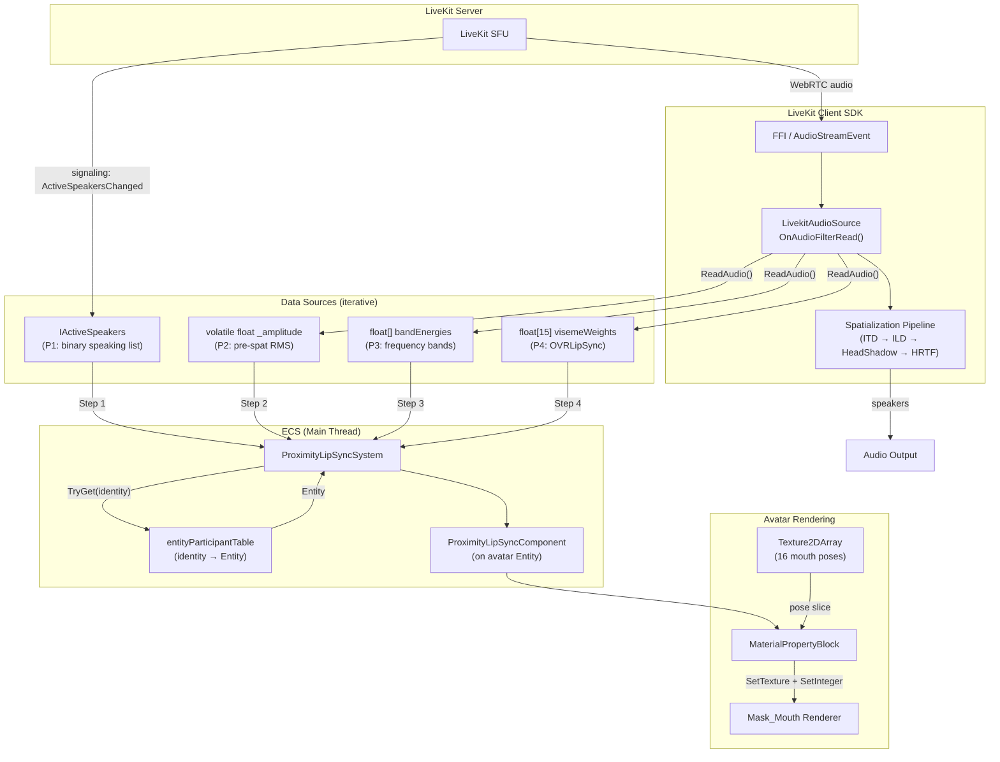

# ADR: Voice-Driven Lip Sync for Proximity Chat Avatars

> **Status:** Proposed  
> **Date:** 2026-03-12  
> **Authors:** Investigation session (human + AI)  
> **Related:** [ADR_proximity_voice_chat.md](../ADR_proximity_voice_chat.md), PR #7452 (`feat/avatar-blink`)

---

## Context

Proximity voice chat работает: игроки слышат друг друга с 3D spatial audio через LiveKit. Однако аватары остаются визуально статичными во время речи — нет анимации рта, нет лицевой обратной связи. Это снижает социальное присутствие.

Существует прототип от @olavra (PR #7452) — **текстовый** lip sync: `AvatarMouthAnimationSystem` анимирует рот по chat messages, маппя символы → визем-индексы через `MapCharToPhoneme`. Визуализация через `MaterialPropertyBlock` + `Texture2DArray` на `Mask_Mouth` рендерере.

Данный ADR покрывает **голосовой** lip sync: анимация рта в ответ на аудио из proximity voice chat. Это принципиально другой входной канал (PCM аудио vs строка текста), который использует тот же визуальный выход.

---

## Decision 1: Источник данных — итеративная прогрессия (P1 → P2 → P3 → P4)

### Рассмотренные варианты

| ID | Источник | Что даёт | Задержка | Гранулярность | Потокобезопасность | LiveKit changes |
|----|----------|----------|----------|---------------|-------------------|-----------------|
| **P1** | `IActiveSpeakers` (Island Room) | bool: говорит/молчит | Signaling ~200–500ms | ~4–5 updates/sec | Уже на main thread | Ноль |
| **P2** | RMS в `OnAudioFilterRead` | float 0..1 амплитуда | Real-time | ~46/sec (48kHz/1024) | `Interlocked.Exchange` | ~5 строк |
| **P3** | FFT bands в `OnAudioFilterRead` | float[3-4] энергия по полосам | Real-time | ~46/sec | volatile struct или lock | ~30-50 строк |
| **P4** | OVRLipSync `ProcessFrame` | float[15] визем-веса | Real-time | ~46/sec | lock + array copy | ~5 строк + внешний плагин |
| ~~P0~~ | ~~`Participant.AudioLevel`~~ | ~~float 0..1~~ | — | — | — | ~~Dead code~~ |

**`Participant.AudioLevel` — мёртвый код:** свойство объявлено с `private set` и нигде не устанавливается. `ActiveSpeakersChanged` несёт только `ParticipantIdentities` (список строк), не значения громкости. Непригоден без FFI-level работы.

**`AudioSource.GetOutputData`** — читает post-spatialization данные с main thread. Амплитуда зависит от положения слушателя — некорректно для lip sync. Отвергнут.

### Выбрано: P1 → P2 → (P3 optional) → P4

- **P1** для валидации полного пайплайна (ECS → renderer → MaterialPropertyBlock)
- **P2** когда нужна реактивность на громкость (~5 строк в LiveKit)
- **P3** как промежуточный если OVR недоступен
- **P4** для максимального качества

---

## Decision 2: Алгоритм визуализации — итеративная прогрессия (A1 → A6)

### Рассмотренные варианты

| ID | Алгоритм | Входные данные | Выход | Качество | Сложность |
|----|----------|----------------|-------|----------|-----------|
| **A1** | Binary open/close | bool speaking | 2 спрайта (закрыт/открыт) | "Рот хлопает" | Тривиально |
| **A2** | Random animation | bool speaking | Рандомная последовательность из 6-8 поз при speaking=true, ~10 fps | "Аниме-стиль", мозг дорисовывает | Просто |
| **A3** | Amplitude → openness | float amplitude | 3-4 спрайта по порогам | Реагирует на громкость | Просто |
| **A4** | Amplitude + weighted random | float amplitude | Случайный спрайт из подмножества, взвешенного по амплитуде | Органичнее A3 | Средне |
| **A5** | FFT → frequency bands → approx. visemes | float[] band energies | Приблизительные виземы по частотным полосам | Различает гласные/согласные | Средне-сложно |
| **A6** | OVRLipSync visemes → sprite mapping | float[15] viseme weights | Прямой маппинг 15 визем → 12-16 поз | Наилучшее | Средне |

### Выбрано: A2 → A4 → A5 → A6

Рекомендуемые комбинации:
```
Шаг 1:  A2 + P1   "Random animation при IActiveSpeakers"
Шаг 2:  A4 + P2   "Amplitude + weighted random из OnAudioFilterRead"
Шаг 3:  A5 + P3   "FFT frequency bands → approximate visemes"
Шаг 4:  A6 + P4   "OVRLipSync визем → sprite mapping"
```

Каждый шаг independently shippable. Можно пропустить Шаг 3 если OVRLipSync доступен.

---

## Decision 3: Визуализация — MaterialPropertyBlock + Texture2DArray

### Выбрано: паттерн из PR #7452

- **Спрайт-атлас:** `Mouth_Atlas.png` (1024×1024, 4×4 grid of 256px cells = 16 поз)
- **Рендерер:** `Mask_Mouth` — найти через `avatarShape.InstantiatedWearables`, `renderer.name.EndsWith("Mask_Mouth")`
- **Слайсинг:** При инициализации — `Graphics.Blit` каждой 256×256 ячейки в `RenderTexture` → `ReadPixels` → `CopyTexture` в `Texture2DArray` (код из `AvatarPlugin.CreateMouthPhonemeTextureArrayAsync`)
- **Применение:** Статический `MaterialPropertyBlock`, переиспользуемый каждый кадр:
  ```csharp
  s_Mpb.Clear();
  s_Mpb.SetTexture(MAINTEX_ARR_TEX_SHADER, phonemeTextureArray);
  s_Mpb.SetInteger(MAINTEX_ARR_SHADER_INDEX, poseIndex);
  mouthRenderer.SetPropertyBlock(s_Mpb);
  ```
- **Сброс:** `SetPropertyBlock(null)` → возврат к дефолтной текстуре материала
- **Не модифицирует shared pool material** — нет texture bleed на другие рендереры (глаза, брови)

### Обоснование

Доказано в PR #7452. Без побочных эффектов на другие facial feature renderers.

---

## Decision 4: ECS-архитектура — queries в ProximityAudioPositionSystem

### Рассмотренные варианты

| Вариант | Описание | Плюсы | Минусы |
|---------|----------|-------|--------|
| Расширить `ProximityAudioPositionSystem` | Добавить lip sync queries в существующую систему | Один system, shared deps, те же словари | Нарушает single responsibility |
| Новая `ProximityLipSyncSystem` | Отдельная система, тот же group | Чистое разделение | Нужны те же зависимости, лишний DI |
| Bridge component | Компонент пишется VoiceChat, читается AvatarRendering | Развязка assemblies | Лишняя индирекция |

### Выбрано: расширить ProximityAudioPositionSystem

Реализовано в Шаге 1. Lip sync добавлен в существующую систему двумя элементами:

1. **`SetupPendingLipSync()`** — ручной метод (паттерн `AssignPendingSources`), итерирует `activeAudioSources` dict, добавляет `ProximityLipSyncComponent` с `ParticipantIdentity` из ключа словаря.
2. **`[Query] UpdateLipSync(...)`** — source-generated ECS query по образцу `AvatarBlinkSystem.UpdateBlink` из PR #7452. Принимает `ref ProximityLipSyncComponent` + `ref AvatarShapeComponent`. Фильтр `[None(typeof(DeleteEntityIntention))]`.

**Компонент (реализован):**
```csharp
public struct ProximityLipSyncComponent
{
    public string ParticipantIdentity;   // identity из activeAudioSources dict
    public Renderer MouthRenderer;       // Mask_Mouth renderer
    public int CurrentPoseIndex;         // текущая поза в Texture2DArray
    public float PoseHoldTimer;          // minimum hold per pose
}
```

**Общее состояние (в ProximityConfigHolder):**
```csharp
public Texture2DArray? MouthTextureArray;               // слайсы из атласа
public readonly HashSet<string> SpeakingParticipants;   // кто говорит (из ActiveSpeakers)
```

### Обоснование

Система уже имеет доступ к `activeAudioSources`, `entityParticipantTable`, `ProximityConfigHolder`. Создание отдельной системы дублировало бы эти зависимости. Setup через ручной метод — установившийся паттерн (`AssignPendingSources`). Update через `[Query]` — правильный ECS-подход, аналогичный PR #7452.

---

## Decision 5: Приоритизация — голосовой lip sync vs текстовый (PR #7452)

### Конфликт

Обе системы пишут `MaterialPropertyBlock` на один и тот же `Mask_Mouth` рендерер. Если обе активны одновременно, последний writer побеждает.

### Выбрано: голос приоритетнее текста

- **Голосовой lip sync** — real-time, отражает актуальную речь, выше приоритет
- **Текстовый lip sync** (PR #7452) — запускается только когда `IActiveSpeakers` не содержит участника
- Альтернатива: объединить в одну систему с двумя входными каналами

### Обоснование

Голос — более достоверный сигнал. Текстовый lip sync актуален для текстового чата (когда человек не в proximity voice chat), голосовой — для proximity.

---

## Technical Details

### Мёртвый код Participant.AudioLevel

```csharp
// Participant.cs — private set, NEVER assigned:
public bool Speaking { get; private set; }
public float AudioLevel { get; private set; }
```

`ActiveSpeakersChanged` event несёт только `ParticipantIdentities` (строки), а не audio level float. `DefaultActiveSpeakers` — `List<string>`. Починка потребует работы на уровне Rust FFI → proto → C# binding.

### Потокобезопасность: OnAudioFilterRead → ECS

```csharp
// Audio thread (LivekitAudioSource):
internal volatile float LipSyncAmplitude;  // или Interlocked.Exchange

// Main thread (ProximityLipSyncSystem):
float amplitude = livekitAudioSource.LipSyncAmplitude;  // volatile read
```

Atomic float read/write гарантирован на x86/x64. Для визем-весов (float[15]) — `lock` + `Array.Copy`.

### Точка врезки в OnAudioFilterRead

```csharp
private void OnAudioFilterRead(float[] data, int channels)
{
    Option<AudioStream> resource = stream.Resource;
    if (resource.Has)
    {
        resource.Value.ReadAudio(data.AsSpan(), channels, sampleRate);

        // >>> LIP SYNC RMS — после ReadAudio, до spatialization <<<
        float sum = 0f;
        for (int i = 0; i < data.Length; i++) sum += data[i] * data[i];
        LipSyncAmplitude = Mathf.Sqrt(sum / data.Length);

        bool spatialized = !bypassSpatialization && ...
        if (spatialized && channels >= 2)
            ApplySpatializationPipeline(data, channels);
    }
}
```

### Smoothing и Hysteresis

Сглаживание на main thread (deltaTime-корректированное):
```csharp
smoothed = Mathf.Lerp(smoothed, target, smoothingFactor * dt * 60f);
```

Гистерезис (разные пороги для открытия/закрытия):
```
Open threshold:  0.15  (рот открывается выше этого)
Close threshold: 0.08  (рот закрывается ниже этого)
```

### Группировка спрайтов атласа (скорректировано по визуальному анализу)

**Amplitude-weighted (Шаг 2):**
```
Idle (закрытый):      index 2
SLIGHT (barely open): indices 5, 7, 11, 15
MEDIUM (mid-open):    indices 1, 3, 8, 9, 14
WIDE (wide open):     indices 0, 4, 6, 10, 12, 13
```

**Frequency-band (Шаг 3):**
```
OPEN_VOWEL (A, O):    indices 4, 6, 8, 9, 13
CLOSED_VOWEL (O, E):  indices 1, 5, 7, 11, 14
SIBILANT (S, SH, F):  indices 0, 3, 10, 12, 15
```

### Performance Budget

| Компонент | Cost per unit | При 5 говорящих | При 50 аватарах (5 говорящих) |
|-----------|--------------|-----------------|-------------------------------|
| RMS computation | ~0.01ms | ~0.05ms | ~0.05ms (только говорящие) |
| FFT bands | ~0.05-0.1ms | ~0.25-0.5ms | ~0.25-0.5ms (только говорящие) |
| OVRLipSync ProcessFrame | ~0.1-0.3ms | ~0.5-1.5ms | ~0.5-1.5ms (пул 8 контекстов) |
| MaterialPropertyBlock.Set | ~0.01ms | ~0.05ms | ~0.05ms (только говорящие) |
| Entity resolution | ~0.001ms | ~0.005ms | ~0.05ms (все в словаре) |
| **Total (Step 2)** | — | **~0.1ms** | **~0.1ms** |
| **Total (Step 4 OVR)** | — | **~0.6-1.6ms** | **~0.6-1.6ms** |

---

## Step 1 Findings (post-implementation)

### LiveKit server-side VAD не отпускает speaking

`ActiveSpeakersChanged` приходит от LiveKit server, который использует WebRTC VAD. VAD имеет holdover period (~1–2с) и чувствительность к фоновому шуму. Если микрофон участника ловит ambient noise (кулер, дыхание), VAD **непрерывно** рапортует его как speaking. Рот аватара не переходит в idle.

**Вывод:** Бинарный `IActiveSpeakers` (P1) недостаточен для reliable idle detection. Переход на P2 (amplitude из `OnAudioFilterRead`) критически важен — амплитуда даёт float threshold, позволяя различать тишину от шума.

### Threading issue: FFICallback на native thread

`FFICallback` (`[MonoPInvokeCallback]`) вызывается из native Rust thread. Цепочка: native thread → `FFICallback` → `RoomEventReceived` → `Room.OnEventReceived` → `ActiveSpeakers.Updated` → наш handler пишет в `HashSet<string>`. ECS система читает `HashSet` с main thread.

Формально это data race. На практике не вызывает видимых сбоев из-за малого размера данных. При переходе к Шагу 2 нужно использовать thread-safe структуры (`ConcurrentDictionary`, `volatile`, `Interlocked`).

### Atlas slicing работает корректно

`Graphics.Blit` → `ReadPixels` → `CopyTexture` → `Texture2DArray` — работает с `isReadable: 0` на исходной текстуре (GPU-only Blit). `alphaIsTransparency: 1` совпадает с PR #7452.

## Step 2 Findings (post-implementation)

### Amplitude-based detection устраняет проблему VAD

Вместо бинарного `SpeakingParticipants.Contains()` (Шаг 1, зависел от серверного VAD) — прямое чтение RMS из `LivekitAudioSource.LipSyncAmplitude`. Silence threshold (0.01) надёжно определяет тишину, даже если LiveKit VAD ошибочно считает участника speaking.

### Threading issue решена архитектурно, не исправлением

Шаг 1 имел data race: `HashSet<string>` писался из native thread, читался из main thread. Шаг 2 **обходит** проблему: каждый `LivekitAudioSource` содержит свой `float lipSyncAmplitude`, записываемый через `Interlocked.Exchange` на аудио-потоке и читаемый через `Interlocked.CompareExchange` на main thread. Нет shared mutable collections.

`SpeakingParticipants` HashSet остаётся в `ProximityConfigHolder` (может использоваться другими фичами), но lip sync его больше не читает.

### Локальный manifest для быстрой итерации

`manifest.json` переключен с `git@github.com:decentraland/client-sdk-unity.git#feat/mono-spatial-audio` на `file:../../../LiveKit/client-sdk-unity`. Это позволяет менять `LivekitAudioSource.cs` и видеть результат без push/commit в LiveKit repo. Нужно вернуть на git reference перед merge.

### Стратегия подтверждена: A4 (Amplitude + Weighted Random)

Реализованная стратегия — A4 из Decision 2: амплитуда определяет группу поз, `Random.Range` выбирает конкретную. Тестирование подтвердило: визуально убедительно, рот реактивен к громкости, idle при тишине работает надёжно. Проблема серверного VAD из Шага 1 полностью решена.

## Step 2.5 Findings (post-implementation)

### Bandpass filter слабо отработал

One-pole IIR (6 dB/octave) слишком пологий — даже при сужении cutoffs до 1000–1000 Hz, музыка в том же частотном диапазоне что и речь всё равно проходила. Фундаментальная проблема: один полюс не даёт достаточной крутизны спада для эффективной фильтрации.

**Вывод:** Простой bandpass неэффективен для speech/music discrimination. Нужен анализ спектральной формы (FFT/Goertzel), а не фильтрация.

## Step 3 Findings (post-implementation)

### Goertzel bands реализованы, но музыка по-прежнему распознавалась как речь

Первая реализация FrequencyBands добавила Goertzel анализ на 500/1500/4000 Hz, но:
- Silence gate по-прежнему использовал full-spectrum amplitude → любой звук проходил
- `SelectPoseByBands` только выбирал ТИП позы (vowel/sibilant), но не определял "это речь или музыка"
- Пользователь не видел разницы между режимами

### Spectral peakedness — ключевое исправление

Добавлена проверка: если доминантная полоса составляет < 50% суммарной энергии → вероятно музыка → idle pose:

```csharp
float maxBand = Mathf.Max(low, Mathf.Max(mid, high));
if (maxBand / total < peakednessThreshold) return idlePose;
```

**Логика:** с 3 полосами, идеально равномерное распределение = ratio 0.333. Речь: 0.5-0.9 (энергия в 1-2 полосах). Музыка: 0.33-0.45 (равномерное распределение). Порог 0.50 — эмпирическая золотая середина.

### Оптимизация дефолтов

Полная ревизия дефолтных значений для voice chat сценария:

| Параметр | Было | Стало | Причина |
|----------|------|-------|---------|
| `LipSyncMode` | AmplitudeWeighted | FrequencyBands | Единственный режим с music rejection |
| `AmplitudeSensitivity` | 8 | 5 | Перебор усиливал шум |
| `SmoothingFactor` | 0.3 | 0.25 | Чуть плавнее |
| `SilenceThreshold` | 0.01 | 0.06 | 0.01 пропускал всё |
| `PoseHoldDuration` | 0.1 | 0.08 | Отзывчивее |
| `SpeechBandLowHz` | 300 | 200 | Мужские голоса |
| `SpeechBandHighHz` | 3000 | 3500 | Сибилянты |
| `SpectralPeakedness` | — | 0.50 | Новый: music rejection |

### Goertzel формула исправлена

Убрано лишнее +0.5 смещение в коэффициенте: `2·cos(2π·(0.5+N·f/fs)/N)` → `2·cos(2π·f/fs)`. Влияние на результат минимальное, но формула теперь стандартная.

### Pose groups скорректированы по визуальному анализу атласа

Amplitude-weighted: `SLIGHT{5,7,11,15}`, `MEDIUM{1,3,8,9,14}`, `WIDE{0,4,6,10,12,13}`  
Frequency-band: `OPEN_VOWEL{4,6,8,9,13}`, `CLOSED_VOWEL{1,5,7,11,14}`, `SIBILANT{0,3,10,12,15}`

---

## Consequences

### Positive

- Немедленное улучшение социального присутствия с Шага 1 (часы работы)
- Каждая итерация independently shippable
- Ноль изменений LiveKit SDK для MVP
- Переиспользует доказанные паттерны из кодовой базы
- Масштабируется на 50+ аватаров

### Negative

- Шаги 1-2 дают не настоящий lip sync (приблизительный)
- Шаги 2-4 требуют минимальных изменений в LiveKit SDK
- OVRLipSync (Шаг 4) вносит внешнюю нативную зависимость
- Assembly coupling между VoiceChat и AvatarRendering
- Нужна координация с PR #7452 для избежания конфликтов MaterialPropertyBlock

### Risks

- Частота обновления `IActiveSpeakers` (~4-5/sec) может ощущаться laggy на Шаге 1 — mitigation: hold-time на позах и продолжение random animation
- Лицензия OVRLipSync может ограничить дистрибуцию — mitigation: FFT как fallback (Шаг 3)
- Re-instantiation аватара (смена wearable) может сломать lip sync — mitigation: null-check + re-find паттерн из PR #7452

---

## Data Flow Diagram



---

## References

- PR #7452: https://github.com/decentraland/unity-explorer/pull/7452
- `LivekitAudioSource.cs`: `client-sdk-unity/Runtime/Scripts/Rooms/Streaming/Audio/LivekitAudioSource.cs`
- `ProximityVoiceChatManager.cs`: `Explorer/Assets/DCL/VoiceChat/Proximity/ProximityVoiceChatManager.cs`
- `ProximityAudioPositionSystem.cs`: `Explorer/Assets/DCL/VoiceChat/Proximity/Systems/ProximityAudioPositionSystem.cs`
- `Participant.cs`: `client-sdk-unity/Runtime/Scripts/Rooms/Participants/Participant.cs`
- `DefaultActiveSpeakers.cs`: `client-sdk-unity/Runtime/Scripts/Rooms/ActiveSpeakers/DefaultActiveSpeakers.cs`
- `VoiceChatParticipantsStateService.cs`: `Explorer/Assets/DCL/VoiceChat/VoiceChatParticipantsStateService.cs`
- OVRLipSync SDK: https://developer.oculus.com/documentation/unity/audio-ovrlipsync-unity/
