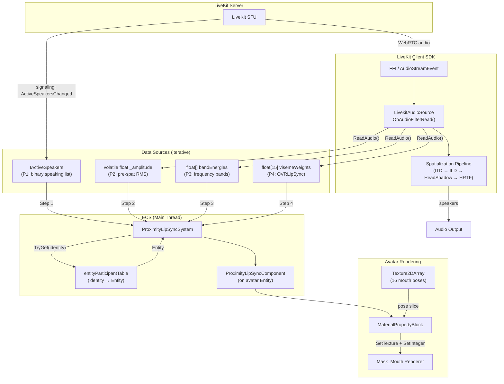

# ADR: Voice-Driven Lip Sync for Proximity Chat Avatars

> **Status:** Proposed  
> **Date:** 2026-03-12  
> **Authors:** Investigation session (human + AI)  
> **Related:** [ADR_proximity_voice_chat.md](../ADR_proximity_voice_chat.md), PR #7452 (`feat/avatar-blink`)

---

## Context

Proximity voice chat работает: игроки слышат друг друга с 3D spatial audio через LiveKit. Однако аватары остаются визуально статичными во время речи — нет анимации рта, нет лицевой обратной связи. Это снижает социальное присутствие.

Существует прототип от @olavra (PR #7452) — **текстовый** lip sync: `AvatarMouthAnimationSystem` анимирует рот по chat messages, маппя символы → визем-индексы через `MapCharToPhoneme`. Визуализация через `MaterialPropertyBlock` + `Texture2DArray` на `Mask_Mouth` рендерере.

Данный ADR покрывает **голосовой** lip sync: анимация рта в ответ на аудио из proximity voice chat. Это принципиально другой входной канал (PCM аудио vs строка текста), который использует тот же визуальный выход.

---

## Decision 1: Источник данных — итеративная прогрессия (P1 → P2 → P3 → P4)

### Рассмотренные варианты

| ID | Источник | Что даёт | Задержка | Гранулярность | Потокобезопасность | LiveKit changes |
|----|----------|----------|----------|---------------|-------------------|-----------------|
| **P1** | `IActiveSpeakers` (Island Room) | bool: говорит/молчит | Signaling ~200–500ms | ~4–5 updates/sec | Уже на main thread | Ноль |
| **P2** | RMS в `OnAudioFilterRead` | float 0..1 амплитуда | Real-time | ~46/sec (48kHz/1024) | `Interlocked.Exchange` | ~5 строк |
| **P3** | FFT bands в `OnAudioFilterRead` | float[3-4] энергия по полосам | Real-time | ~46/sec | volatile struct или lock | ~30-50 строк |
| **P4** | OVRLipSync `ProcessFrame` | float[15] визем-веса | Real-time | ~46/sec | lock + array copy | ~5 строк + внешний плагин |
| ~~P0~~ | ~~`Participant.AudioLevel`~~ | ~~float 0..1~~ | — | — | — | ~~Dead code~~ |

**`Participant.AudioLevel` — мёртвый код:** свойство объявлено с `private set` и нигде не устанавливается. `ActiveSpeakersChanged` несёт только `ParticipantIdentities` (список строк), не значения громкости. Непригоден без FFI-level работы.

**`AudioSource.GetOutputData`** — читает post-spatialization данные с main thread. Амплитуда зависит от положения слушателя — некорректно для lip sync. Отвергнут.

### Выбрано: P1 → P2 → (P3 optional) → P4

- **P1** для валидации полного пайплайна (ECS → renderer → MaterialPropertyBlock)
- **P2** когда нужна реактивность на громкость (~5 строк в LiveKit)
- **P3** как промежуточный если OVR недоступен
- **P4** для максимального качества

---

## Decision 2: Алгоритм визуализации — итеративная прогрессия (A1 → A6)

### Рассмотренные варианты

| ID | Алгоритм | Входные данные | Выход | Качество | Сложность |
|----|----------|----------------|-------|----------|-----------|
| **A1** | Binary open/close | bool speaking | 2 спрайта (закрыт/открыт) | "Рот хлопает" | Тривиально |
| **A2** | Random animation | bool speaking | Рандомная последовательность из 6-8 поз при speaking=true, ~10 fps | "Аниме-стиль", мозг дорисовывает | Просто |
| **A3** | Amplitude → openness | float amplitude | 3-4 спрайта по порогам | Реагирует на громкость | Просто |
| **A4** | Amplitude + weighted random | float amplitude | Случайный спрайт из подмножества, взвешенного по амплитуде | Органичнее A3 | Средне |
| **A5** | FFT → frequency bands → approx. visemes | float[] band energies | Приблизительные виземы по частотным полосам | Различает гласные/согласные | Средне-сложно |
| **A6** | OVRLipSync visemes → sprite mapping | float[15] viseme weights | Прямой маппинг 15 визем → 12-16 поз | Наилучшее | Средне |

### Выбрано: A2 → A4 → A5 → A6

Рекомендуемые комбинации:
```
Шаг 1:  A2 + P1   "Random animation при IActiveSpeakers"
Шаг 2:  A4 + P2   "Amplitude + weighted random из OnAudioFilterRead"
Шаг 3:  A5 + P3   "FFT frequency bands → approximate visemes"
Шаг 4:  A6 + P4   "OVRLipSync визем → sprite mapping"
```

Каждый шаг independently shippable. Можно пропустить Шаг 3 если OVRLipSync доступен.

---

## Decision 3: Визуализация — MaterialPropertyBlock + Texture2DArray

### Выбрано: паттерн из PR #7452

- **Спрайт-атлас:** `Mouth_Atlas.png` (1024×1024, 4×4 grid of 256px cells = 16 поз)
- **Рендерер:** `Mask_Mouth` — найти через `avatarShape.InstantiatedWearables`, `renderer.name.EndsWith("Mask_Mouth")`
- **Слайсинг:** При инициализации — `Graphics.Blit` каждой 256×256 ячейки в `RenderTexture` → `ReadPixels` → `CopyTexture` в `Texture2DArray` (код из `AvatarPlugin.CreateMouthPhonemeTextureArrayAsync`)
- **Применение:** Статический `MaterialPropertyBlock`, переиспользуемый каждый кадр:
  ```csharp
  s_Mpb.Clear();
  s_Mpb.SetTexture(MAINTEX_ARR_TEX_SHADER, phonemeTextureArray);
  s_Mpb.SetInteger(MAINTEX_ARR_SHADER_INDEX, poseIndex);
  mouthRenderer.SetPropertyBlock(s_Mpb);
  ```
- **Сброс:** `SetPropertyBlock(null)` → возврат к дефолтной текстуре материала
- **Не модифицирует shared pool material** — нет texture bleed на другие рендереры (глаза, брови)

### Обоснование

Доказано в PR #7452. Без побочных эффектов на другие facial feature renderers.

---

## Decision 4: ECS-архитектура — shared dictionary pattern

### Рассмотренные варианты

| Вариант | Описание | Плюсы | Минусы |
|---------|----------|-------|--------|
| Расширить `ProximityAudioPositionSystem` | Добавить lip sync логику в существующую систему | Один system, shared deps | Нарушает single responsibility |
| Новая `ProximityLipSyncSystem` | Отдельная система, тот же group | Чистое разделение | Нужны те же зависимости |
| Bridge component | Компонент пишется VoiceChat, читается AvatarRendering | Развязка assemblies | Лишняя индирекция |

### Выбрано: новая ProximityLipSyncSystem с shared dictionary

`PresentationSystemGroup`, `UpdateAfter(ProximityAudioPositionSystem)`. Тот же паттерн что и для аудио-позиций: итерация shared dictionary → resolve identity → entity через `entityParticipantTable` → add/update компонент.

**Компонент:**
```csharp
public struct ProximityLipSyncComponent
{
    public Renderer MouthRenderer;          // Mask_Mouth renderer
    public int CurrentPoseIndex;            // -1 = no override (default material)
    public float PoseHoldTimer;             // minimum hold per pose
    public float SmoothedAmplitude;         // for Steps 2+
    public float RandomSeed;               // per-avatar randomization
    public bool IsSpeaking;                // cached state
}
```

**Data flow:**
```
IActiveSpeakers / LivekitAudioSource._amplitude
    ↓
ProximityLipSyncSystem.Update()
    ↓
foreach participant in data source:
    entityParticipantTable.TryGet(identity) → Entity
    if no ProximityLipSyncComponent → find Mask_Mouth, World.Add
    update SmoothedAmplitude, select pose, apply MaterialPropertyBlock
    ↓
Cleanup: remove component when participant leaves or renderer null
```

### Обоснование

Зеркалит доказанную архитектуру `ProximityAudioPositionSystem`. `ConcurrentDictionary` bridging избегает race conditions. Retry каждый кадр обрабатывает случай когда Entity ещё не создан на момент subscribe.

---

## Decision 5: Приоритизация — голосовой lip sync vs текстовый (PR #7452)

### Конфликт

Обе системы пишут `MaterialPropertyBlock` на один и тот же `Mask_Mouth` рендерер. Если обе активны одновременно, последний writer побеждает.

### Выбрано: голос приоритетнее текста

- **Голосовой lip sync** — real-time, отражает актуальную речь, выше приоритет
- **Текстовый lip sync** (PR #7452) — запускается только когда `IActiveSpeakers` не содержит участника
- Альтернатива: объединить в одну систему с двумя входными каналами

### Обоснование

Голос — более достоверный сигнал. Текстовый lip sync актуален для текстового чата (когда человек не в proximity voice chat), голосовой — для proximity.

---

## Technical Details

### Мёртвый код Participant.AudioLevel

```csharp
// Participant.cs — private set, NEVER assigned:
public bool Speaking { get; private set; }
public float AudioLevel { get; private set; }
```

`ActiveSpeakersChanged` event несёт только `ParticipantIdentities` (строки), а не audio level float. `DefaultActiveSpeakers` — `List<string>`. Починка потребует работы на уровне Rust FFI → proto → C# binding.

### Потокобезопасность: OnAudioFilterRead → ECS

```csharp
// Audio thread (LivekitAudioSource):
internal volatile float LipSyncAmplitude;  // или Interlocked.Exchange

// Main thread (ProximityLipSyncSystem):
float amplitude = livekitAudioSource.LipSyncAmplitude;  // volatile read
```

Atomic float read/write гарантирован на x86/x64. Для визем-весов (float[15]) — `lock` + `Array.Copy`.

### Точка врезки в OnAudioFilterRead

```csharp
private void OnAudioFilterRead(float[] data, int channels)
{
    Option<AudioStream> resource = stream.Resource;
    if (resource.Has)
    {
        resource.Value.ReadAudio(data.AsSpan(), channels, sampleRate);

        // >>> LIP SYNC RMS — после ReadAudio, до spatialization <<<
        float sum = 0f;
        for (int i = 0; i < data.Length; i++) sum += data[i] * data[i];
        LipSyncAmplitude = Mathf.Sqrt(sum / data.Length);

        bool spatialized = !bypassSpatialization && ...
        if (spatialized && channels >= 2)
            ApplySpatializationPipeline(data, channels);
    }
}
```

### Smoothing и Hysteresis

Сглаживание на main thread (deltaTime-корректированное):
```csharp
smoothed = Mathf.Lerp(smoothed, target, smoothingFactor * dt * 60f);
```

Гистерезис (разные пороги для открытия/закрытия):
```
Open threshold:  0.15  (рот открывается выше этого)
Close threshold: 0.08  (рот закрывается ниже этого)
```

### Группировка спрайтов атласа по интенсивности

```
Idle (закрытый):      index 2
Слабо открытые:       indices 5, 8, 11
Средне открытые:      indices 1, 3, 4, 6, 9, 10
Широко открытые:      indices 0, 7, 12, 13, 14, 15
```

Первый проход — коррекция после визуального тестирования.

### Performance Budget

| Компонент | Cost per unit | При 5 говорящих | При 50 аватарах (5 говорящих) |
|-----------|--------------|-----------------|-------------------------------|
| RMS computation | ~0.01ms | ~0.05ms | ~0.05ms (только говорящие) |
| FFT bands | ~0.05-0.1ms | ~0.25-0.5ms | ~0.25-0.5ms (только говорящие) |
| OVRLipSync ProcessFrame | ~0.1-0.3ms | ~0.5-1.5ms | ~0.5-1.5ms (пул 8 контекстов) |
| MaterialPropertyBlock.Set | ~0.01ms | ~0.05ms | ~0.05ms (только говорящие) |
| Entity resolution | ~0.001ms | ~0.005ms | ~0.05ms (все в словаре) |
| **Total (Step 2)** | — | **~0.1ms** | **~0.1ms** |
| **Total (Step 4 OVR)** | — | **~0.6-1.6ms** | **~0.6-1.6ms** |

---

## Consequences

### Positive

- Немедленное улучшение социального присутствия с Шага 1 (часы работы)
- Каждая итерация independently shippable
- Ноль изменений LiveKit SDK для MVP
- Переиспользует доказанные паттерны из кодовой базы
- Масштабируется на 50+ аватаров

### Negative

- Шаги 1-2 дают не настоящий lip sync (приблизительный)
- Шаги 2-4 требуют минимальных изменений в LiveKit SDK
- OVRLipSync (Шаг 4) вносит внешнюю нативную зависимость
- Assembly coupling между VoiceChat и AvatarRendering
- Нужна координация с PR #7452 для избежания конфликтов MaterialPropertyBlock

### Risks

- Частота обновления `IActiveSpeakers` (~4-5/sec) может ощущаться laggy на Шаге 1 — mitigation: hold-time на позах и продолжение random animation
- Лицензия OVRLipSync может ограничить дистрибуцию — mitigation: FFT как fallback (Шаг 3)
- Re-instantiation аватара (смена wearable) может сломать lip sync — mitigation: null-check + re-find паттерн из PR #7452

---

## Data Flow Diagram



---

## References

- PR #7452: https://github.com/decentraland/unity-explorer/pull/7452
- `LivekitAudioSource.cs`: `client-sdk-unity/Runtime/Scripts/Rooms/Streaming/Audio/LivekitAudioSource.cs`
- `ProximityVoiceChatManager.cs`: `Explorer/Assets/DCL/VoiceChat/Proximity/ProximityVoiceChatManager.cs`
- `ProximityAudioPositionSystem.cs`: `Explorer/Assets/DCL/VoiceChat/Proximity/Systems/ProximityAudioPositionSystem.cs`
- `Participant.cs`: `client-sdk-unity/Runtime/Scripts/Rooms/Participants/Participant.cs`
- `DefaultActiveSpeakers.cs`: `client-sdk-unity/Runtime/Scripts/Rooms/ActiveSpeakers/DefaultActiveSpeakers.cs`
- `VoiceChatParticipantsStateService.cs`: `Explorer/Assets/DCL/VoiceChat/VoiceChatParticipantsStateService.cs`
- OVRLipSync SDK: https://developer.oculus.com/documentation/unity/audio-ovrlipsync-unity/
