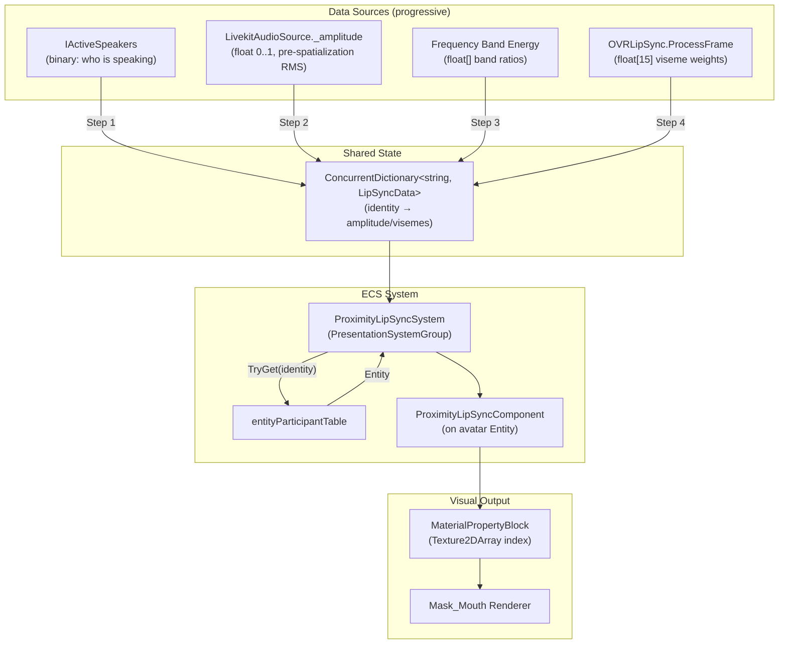

# Implementation Plan: Voice-Driven Lip Sync

> Iterative plan from binary speaking detection to full viseme-based lip sync.

---

## Architecture Overview



---

## Step 1: Binary Speaking + Random Animation (A2 + P1)

> **Goal:** Avatars' mouths move when they speak. Simplest possible implementation.  
> **Effort:** ~1 day  
> **LiveKit changes:** None  
> **Quality:** "Anime-style" — random mouth shapes while speaking, convincing at distance

### 1.1 Prerequisites

- [ ] Slice `Mouth_Atlas.png` into `Texture2DArray` (16 slices, 256×256 each)
  - Reuse `AvatarPlugin.CreateMouthPhonemeTextureArrayAsync` pattern from PR #7452
  - `Graphics.Blit` per cell → `RenderTexture` → `ReadPixels` → `CopyTexture` into array
  - Create at plugin initialization, destroy on dispose

- [ ] Create feature flag for lip sync in `FeaturesRegistry`

### 1.2 Data Source: IActiveSpeakers

Access `islandRoom.ActiveSpeakers` — already available in `ProximityVoiceChatManager`.

**Bridge to ECS:** New shared dictionary `ConcurrentDictionary<string, bool>` (identity → isSpeaking). Updated by subscribing to `islandRoom.ActiveSpeakers.Updated`:

```csharp
// In ProximityVoiceChatManager or a dedicated service:
islandRoom.ActiveSpeakers.Updated += () =>
{
    speakingStates.Clear(); // or diff-update
    foreach (string identity in islandRoom.ActiveSpeakers)
        speakingStates[identity] = true;
};
```

Alternative: pass `IActiveSpeakers` reference directly to the ECS system constructor (read-only, iterated on main thread). Simpler, avoids extra dictionary.

### 1.3 ECS Component

```csharp
public struct ProximityLipSyncComponent
{
    /// Mask_Mouth renderer. Null when pending setup or avatar re-instantiated.
    public Renderer MouthRenderer;

    /// Current sprite pose index in the Texture2DArray. -1 = no override (default material).
    public int CurrentPoseIndex;

    /// Timer for minimum hold duration per pose.
    public float PoseHoldTimer;

    /// Per-avatar random seed for animation variety (avoids all mouths moving in sync).
    public float RandomSeed;

    /// True while the avatar is currently speaking.
    public bool IsSpeaking;
}
```

### 1.4 ECS System: ProximityLipSyncSystem

```
[UpdateInGroup(typeof(PresentationSystemGroup))]
[UpdateAfter(typeof(ProximityAudioPositionSystem))]
public partial class ProximityLipSyncSystem : BaseUnityLoopSystem
```

**Constructor dependencies:**
- `IReadOnlyEntityParticipantTable entityParticipantTable`
- `IActiveSpeakers activeSpeakers` (from Island Room)
- `Texture2DArray phonemeTextureArray` (sliced atlas)
- Configuration: `poseHoldDuration` (0.08–0.12s), `idlePoseIndex` (2)

**Update flow:**

```
Update(float dt):
    1. AssignPendingLipSync()
       - foreach identity in activeSpeakers:
         - entityParticipantTable.TryGet(identity) → Entity
         - if entity has AvatarShapeComponent but no ProximityLipSyncComponent:
           - FindMouthRenderer(ref avatarShape) → Renderer
           - if found: World.Add(entity, new ProximityLipSyncComponent { ... })
    
    2. UpdateLipSyncQuery(World, dt)
       - foreach entity with ProximityLipSyncComponent + AvatarShapeComponent:
         - if MouthRenderer == null → re-find (wearable re-instantiation)
         - if not visible → reset to idle, skip
         - determine isSpeaking from activeSpeakers.Contains(identity)
         - if speaking:
           - PoseHoldTimer += dt
           - if PoseHoldTimer >= poseHoldDuration:
             - select random pose from speech subset (indices 1-11)
             - apply MaterialPropertyBlock
             - reset timer
         - if not speaking:
           - if CurrentPoseIndex != idle:
             - clear MaterialPropertyBlock (revert to default)
             - CurrentPoseIndex = -1
    
    3. CleanupQuery(World)
       - remove ProximityLipSyncComponent when MouthRenderer == null and can't re-find
```

### 1.5 Sprite Selection (Random)

When speaking, select from "speech" pose subset. Use per-avatar `RandomSeed` to offset timing:

```csharp
// Speech pose indices (all non-idle poses from the atlas)
static readonly int[] SPEECH_POSES = { 0, 1, 3, 4, 5, 6, 7, 8, 9, 10, 11, 12, 13, 14, 15 };
const int IDLE_POSE = 2; // closed mouth

int index = (int)((Time.time + component.RandomSeed) * 10f) % SPEECH_POSES.Length;
// or: hash-based selection for more apparent randomness
int index = Mathf.Abs((int)(component.RandomSeed * 1000 + poseChangeCounter)) % SPEECH_POSES.Length;
```

### 1.6 MaterialPropertyBlock Application

```csharp
static readonly MaterialPropertyBlock s_Mpb = new MaterialPropertyBlock();
static readonly int MAINTEX_ARR_SHADER_INDEX = Shader.PropertyToID("_MainTexArr_Index");
static readonly int MAINTEX_ARR_TEX_SHADER = Shader.PropertyToID("_MainTexArr");

void ApplyPose(ref ProximityLipSyncComponent lip, int poseIndex, Texture2DArray texArray)
{
    if (lip.CurrentPoseIndex == poseIndex) return;
    lip.CurrentPoseIndex = poseIndex;

    if (poseIndex < 0)
    {
        lip.MouthRenderer.SetPropertyBlock(null);
        return;
    }

    s_Mpb.Clear();
    s_Mpb.SetTexture(MAINTEX_ARR_TEX_SHADER, texArray);
    s_Mpb.SetInteger(MAINTEX_ARR_SHADER_INDEX, poseIndex);
    lip.MouthRenderer.SetPropertyBlock(s_Mpb);
}
```

### 1.7 Cleanup

- When participant leaves (`ActiveSpeakers` no longer contains identity): set idle pose
- When `MouthRenderer` is null (wearable re-instantiation): re-find via `FindMouthRenderer`
- When entity is destroyed (`DeleteEntityIntention`): nothing to clean — component goes with entity
- On system dispose / world finalize: revert all property blocks to null

### 1.8 File Structure

```
Explorer/Assets/DCL/VoiceChat/Proximity/
├── LipSync/
│   ├── ProximityLipSyncComponent.cs
│   ├── ProximityLipSyncSystem.cs
│   └── LipSyncConfiguration.cs          (ScriptableObject or settings class)
├── Mouth_Atlas.png
├── Mouth_Atlas.png.meta
└── ...existing files...
```

### 1.9 Acceptance Criteria

- [ ] When a proximity chat participant speaks, their avatar's mouth animates with random poses
- [ ] When they stop speaking, mouth returns to idle within ~200ms
- [ ] Multiple avatars animate independently (not in sync)
- [ ] Avatar re-instantiation (wearable change) doesn't break lip sync
- [ ] Invisible avatars skip processing
- [ ] Feature flag toggles lip sync on/off
- [ ] No allocations per frame (reuse MaterialPropertyBlock, no LINQ, no closures)

---

## Step 2: Amplitude-Weighted Random (A4 + P2)

> **Goal:** Mouth responsiveness reflects actual speech dynamics (loud = open, quiet = small).  
> **Effort:** ~0.5–1 day (on top of Step 1)  
> **LiveKit changes:** ~5 lines in `LivekitAudioSource`

### 2.1 LiveKit SDK Change

In `LivekitAudioSource.cs`, add a public amplitude field and compute it in `OnAudioFilterRead`:

```csharp
// New field (thread-safe, read from main thread):
internal volatile float LipSyncAmplitude;

// In OnAudioFilterRead, after ReadAudio, before spatialization check:
private void OnAudioFilterRead(float[] data, int channels)
{
    Option<AudioStream> resource = stream.Resource;
    if (resource.Has)
    {
        resource.Value.ReadAudio(data.AsSpan(), channels, sampleRate);

        // Lip sync: pre-spatialization RMS amplitude
        float sum = 0f;
        for (int i = 0; i < data.Length; i++) sum += data[i] * data[i];
        LipSyncAmplitude = Mathf.Sqrt(sum / data.Length);

        bool spatialized = ...
    }
}
```

### 2.2 Data Bridge Update

Change shared dictionary from `ConcurrentDictionary<string, bool>` to `ConcurrentDictionary<string, float>` (identity → amplitude). In `ProximityVoiceChatManager`, update amplitude each frame from `LivekitAudioSource.LipSyncAmplitude`:

Alternative: ECS system reads amplitude directly from `LivekitAudioSource` component referenced via `ProximityAudioSourceComponent`. This avoids the extra dictionary entirely — the amplitude is already on the `LivekitAudioSource` MonoBehaviour attached to the same AudioSource.

### 2.3 Component Extension

```csharp
public struct ProximityLipSyncComponent
{
    // ...existing fields from Step 1...
    
    /// Smoothed amplitude 0..1 for visual continuity.
    public float SmoothedAmplitude;
}
```

### 2.4 Algorithm: Amplitude-Weighted Pose Selection

Group poses by "openness tier":

```csharp
static readonly int[] IDLE = { 2 };
static readonly int[] SLIGHT = { 5, 8, 11 };          // quiet speech
static readonly int[] MEDIUM = { 1, 3, 4, 6, 9, 10 }; // normal speech
static readonly int[] WIDE = { 0, 7, 12, 13, 14, 15 }; // loud speech

const float THRESHOLD_SLIGHT = 0.05f;
const float THRESHOLD_MEDIUM = 0.15f;
const float THRESHOLD_WIDE = 0.35f;
```

Selection logic:

```
smoothed = Lerp(smoothed, rawAmplitude * sensitivity, smoothingFactor * dt * 60)

if smoothed < THRESHOLD_SLIGHT:
    → IDLE[0]
else if smoothed < THRESHOLD_MEDIUM:
    → random from SLIGHT (seeded by avatar + time)
else if smoothed < THRESHOLD_WIDE:
    → random from MEDIUM
else:
    → random from WIDE
```

### 2.5 Smoothing and Hysteresis

```csharp
// Exponential smoothing (main thread, deltaTime-corrected):
float target = lipSyncAmplitude * sensitivity;
component.SmoothedAmplitude = Mathf.Lerp(
    component.SmoothedAmplitude,
    target,
    smoothingFactor * dt * 60f  // 60f normalizes to 60fps baseline
);

// Hysteresis: use different thresholds for "opening" vs "closing"
float threshold = currentlyOpen ? closeThreshold : openThreshold;
// closeThreshold < openThreshold (e.g., 0.08 vs 0.15)
```

### 2.6 Accessing Amplitude from ECS

Option A (preferred): `ProximityAudioSourceComponent` already holds a reference to `AudioSource`. Get the `LivekitAudioSource` from the same GameObject:

```csharp
// In the ECS system, when ProximityAudioSourceComponent is available:
LivekitAudioSource lka = proximityAudio.AudioSource.GetComponent<LivekitAudioSource>();
float amplitude = lka != null ? lka.LipSyncAmplitude : 0f;
```

Option B: Separate `ConcurrentDictionary<string, float>` bridging amplitude data.

Option A avoids extra dictionaries and leverages existing component references.

### 2.7 Acceptance Criteria (in addition to Step 1)

- [ ] Mouth openness visually corresponds to speech volume
- [ ] Quiet speech → slightly open poses; loud speech → wide open poses
- [ ] Smooth transitions (no jittering between poses)
- [ ] Amplitude reads from pre-spatialization data (not affected by listener position)
- [ ] No audible audio artifacts from the RMS computation

---

## Step 3: FFT Frequency Band Analysis (Optional — A3/C + P2)

> **Goal:** Distinguish vowels from consonants for more varied mouth shapes.  
> **Effort:** ~2–3 days  
> **LiveKit changes:** Extended `OnAudioFilterRead` processing  
> **Skip if:** Going directly to OVRLipSync (Step 4)

### 3.1 Frequency Band Design

Divide the spectrum into 3–5 bands based on speech characteristics:

| Band | Frequency Range | Speech Content | Mouth Association |
|------|----------------|----------------|-------------------|
| Low | 200–800 Hz | Fundamental + first formant (A, O) | Wide open |
| Mid-Low | 800–1800 Hz | Second formant (E, I) | Medium rounded |
| Mid-High | 1800–3500 Hz | Consonant transitions, nasals | Slightly open |
| High | 3500–8000 Hz | Sibilants (S, SH, F), fricatives | Teeth visible / narrow |

### 3.2 Implementation in OnAudioFilterRead

```csharp
// After ReadAudio, before spatialization:
// 1. Compute RMS (same as Step 2)
// 2. Simple band energy via Goertzel algorithm or DFT on key frequencies
//    (avoid full FFT allocation — Goertzel is O(N) per frequency, no scratch buffer)
// 3. Store band energies in a struct (volatile or Interlocked)

internal volatile float LipSyncAmplitude;
internal volatile float LipSyncBandLow;
internal volatile float LipSyncBandMid;
internal volatile float LipSyncBandHigh;
```

### 3.3 Pose Mapping

Map band energy ratios to pose categories:

```
if (bandLow > bandMid && bandLow > bandHigh):
    → "open vowel" poses (wide open: A, O)
else if (bandMid > bandLow && bandMid > bandHigh):
    → "closed vowel" poses (medium: E, I, U)
else if (bandHigh dominant):
    → "sibilant" poses (teeth visible, narrow)
else:
    → amplitude-weighted random (fallback)
```

### 3.4 Performance Notes

- Goertzel algorithm: O(N) per target frequency, ~4 frequencies × 1024 samples = ~4096 multiply-adds
- Estimated cost: ~0.03–0.05ms per source per audio buffer
- For 10 simultaneous speakers: ~0.3–0.5ms total — acceptable
- For 50: ~1.5–2.5ms — may need throttling (process every 2nd buffer)

### 3.5 Why This Step is Optional

FFT band analysis requires significant tuning per voice type and provides moderate quality improvement over pure amplitude. OVRLipSync (Step 4) achieves much better quality with less custom engineering. **Recommend skipping this step unless OVRLipSync cannot be used** due to licensing or platform constraints.

---

## Step 4: OVRLipSync Viseme Detection (A5 + P3)

> **Goal:** Best possible lip sync quality — 15 visemes mapped to sprite poses.  
> **Effort:** ~1–2 days (on top of Step 2)  
> **Dependencies:** Oculus Lipsync SDK (free, native plugin)

### 4.1 OVRLipSync Integration

Add OVRLipSync Unity package to the project. Create a per-source context and feed PCM data:

```csharp
// One-time setup per audio source:
OVRLipSync.CreateContext(ref context, OVRLipSync.ContextProviders.Enhanced, 48000, 1024, true);

// In OnAudioFilterRead, after ReadAudio:
OVRLipSync.ProcessFrame(context, data, OVRLipSync.Frame frame);
// frame.Visemes = float[15]: Sil, PP, FF, TH, DD, KK, CH, SS, NN, RR, AA, E, I, O, U

// Thread-safe transfer of viseme weights:
lock (_visemeLock) { Array.Copy(frame.Visemes, _visemeWeights, 15); }
```

### 4.2 Viseme → Sprite Mapping

Map 15 standard visemes to the 16 atlas poses. Multiple visemes can map to the same pose:

| Viseme | Description | Atlas Index (suggested) |
|--------|-------------|------------------------|
| Sil | Silence/idle | 2 (closed) |
| PP | B, M, P (lips pressed) | 2 or dedicated "closed tight" |
| FF | F, V (teeth on lip) | 3 (teeth show) |
| TH | Th (tongue between teeth) | 4 (open + tongue) |
| DD | D, T, N, L (tongue on ridge) | 8 (oval open) |
| KK | K, G (back of tongue) | 11 (small open) |
| CH | Ch, J, Sh | 10 (teeth grid) |
| SS | S, Z (sibilant) | 3 (teeth show) |
| NN | N (nasal) | 5 (small O) |
| RR | R | 9 (oval + tongue) |
| AA | A (wide open) | 0 (idle/teeth = wide) or 7 (round O wide) |
| E | E (spread lips) | 6 (smile + tongue) |
| I | I (narrow spread) | 11 (small open) |
| O | O (rounded) | 1 (O-round) or 14 (round) |
| U | U (tight round) | 5 (small O) |

**Note:** This mapping is a first pass and needs visual testing with the actual atlas poses. Adjust after seeing results in-game.

### 4.3 Blending Strategy

OVRLipSync returns weights (0..1) for all 15 visemes. For sprite-based rendering (no blending between sprites), select the viseme with the highest weight:

```csharp
int dominantViseme = 0;
float maxWeight = 0f;
for (int i = 0; i < 15; i++)
{
    if (visemeWeights[i] > maxWeight)
    {
        maxWeight = visemeWeights[i];
        dominantViseme = i;
    }
}
int poseIndex = VISEME_TO_POSE[dominantViseme];
```

For smoother transitions, apply a minimum hold time (same as Steps 1–2) and only switch when the new dominant viseme has been dominant for at least 2 consecutive frames.

### 4.4 Context Pooling (Performance)

For 50+ avatars with typically 2–5 simultaneous speakers:

```csharp
class LipSyncContextPool
{
    const int POOL_SIZE = 8;
    OVRLipSyncContext[] contexts;
    Dictionary<string, int> activeAssignments; // identity → pool index

    // Assign: when participant starts speaking, give them a context
    // Release: when participant stops speaking, return context to pool
    // If pool exhausted: skip lip sync for this participant (fall back to amplitude)
}
```

### 4.5 Performance Budget

| Speakers | OVR cost | RMS cost | Total |
|----------|----------|----------|-------|
| 1 | 0.2ms | 0.01ms | 0.21ms |
| 5 | 1.0ms | 0.05ms | 1.05ms |
| 8 (pool max) | 1.6ms | 0.08ms | 1.68ms |
| 50 (no OVR, amplitude fallback) | 0ms | 0.5ms | 0.5ms |

Budget is within acceptable limits. Participants beyond pool size gracefully degrade to amplitude-based animation.

---

## Configuration (All Steps)

Create `LipSyncSettings` as a serializable class or ScriptableObject:

```csharp
[Serializable]
public class LipSyncSettings
{
    [Header("General")]
    public bool Enabled = true;
    public float MaxDistance = 15f;                    // skip beyond this distance

    [Header("Pose Timing")]
    public float PoseHoldDuration = 0.1f;             // seconds per pose (10 fps)
    public float IdleTransitionDelay = 0.2f;           // hold last pose briefly after speech ends

    [Header("Amplitude (Step 2+)")]
    public float AmplitudeSensitivity = 3.0f;          // multiplier for raw RMS
    public float SmoothingFactor = 0.2f;               // exponential smoothing speed
    public float OpenThreshold = 0.15f;                // hysteresis: open mouth above this
    public float CloseThreshold = 0.08f;               // hysteresis: close mouth below this

    [Header("Atlas")]
    public int IdlePoseIndex = 2;                      // closed mouth pose
    public AssetReferenceT<Texture2D> MouthAtlasTexture;

    [Header("OVRLipSync (Step 4)")]
    public int ContextPoolSize = 8;
}
```

---

## Testing Strategy

### Unit Tests (NUnit + NSubstitute)

- `ProximityLipSyncSystem` with mocked `IActiveSpeakers`, `entityParticipantTable`
- Verify: component added when speaking detected, removed on cleanup
- Verify: pose index changes on update, returns to idle when not speaking
- Verify: `DeleteEntityIntention` entities are skipped

### Manual Testing

- [ ] Connect 2+ clients, speak → verify mouth animation on remote avatars
- [ ] Verify no animation on local avatar
- [ ] Change wearables during speech → verify re-initialization
- [ ] Walk away beyond MaxDistance → verify animation stops
- [ ] Toggle feature flag → verify on/off works
- [ ] Profile with 10+ bots speaking simultaneously → verify frame budget

---

## Rollout Sequence

```
Step 1 (A2+P1)  →  Ship behind feature flag  →  Gather feedback
    ↓
Step 2 (A4+P2)  →  Ship, A/B test vs Step 1  →  Evaluate quality delta
    ↓
[Step 3 optional — only if OVR not viable]
    ↓
Step 4 (A5+P3)  →  Ship behind separate flag  →  Compare quality
    ↓
Remove flags, ship as default
```

---

## Dependencies and Blockers

| Dependency | Required For | Status |
|------------|-------------|--------|
| `Mouth_Atlas.png` in VoiceChat/Proximity | All steps | Done (downloaded) |
| `Texture2DArray` slicing code | All steps | Adapt from PR #7452 |
| `IActiveSpeakers` on Island Room | Step 1 | Already available |
| `entityParticipantTable` access | All steps | Already available via DI |
| AvatarRendering assembly reference | FindMouthRenderer | Needs assembly dependency check |
| LiveKit SDK `OnAudioFilterRead` change | Step 2+ | ~5 lines, trivial |
| OVRLipSync Unity package | Step 4 | Not yet added; evaluate licensing |
| Feature flag registration | All steps | Create new flag |
| PR #7452 coordination | Avoid MaterialPropertyBlock conflict | Discuss with @olavra |
