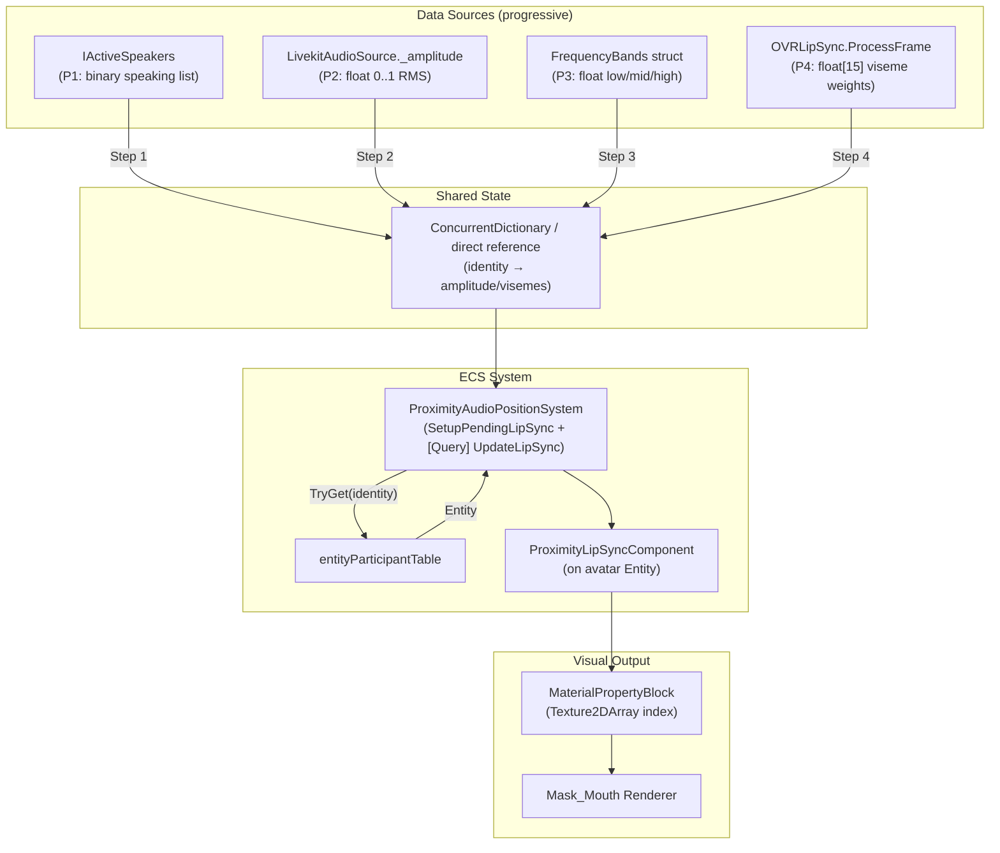

# Implementation Plan: Voice-Driven Lip Sync

> Итеративный план от бинарного детектирования речи до полноценных визем.

---

## Рекомендуемый путь итераций

```
Шаг 1:  A2 + P1   "Random animation при IActiveSpeakers"
    ↓
Шаг 2:  A4 + P2   "Amplitude + weighted random из OnAudioFilterRead"
    ↓
Шаг 3:  A5 + P3   "FFT frequency bands → approximate visemes"
    ↓
Шаг 4:  A6 + P4   "OVRLipSync визем → sprite mapping"
```

Каждый шаг independently shippable. Шаг 3 — промежуточный; можно пропустить если OVRLipSync доступен.

---

## Architecture Overview



---

## Шаг 1: Random Animation при IActiveSpeakers (A2 + P1) — ВЫПОЛНЕН

> **Цель:** Рты аватаров двигаются когда они говорят. Максимально простая реализация.  
> **Статус:** DONE  
> **LiveKit changes:** Ноль  
> **Качество:** "Аниме-стиль" — рандомные формы рта во время речи, убедительно на расстоянии

### 1.1 Пререквизиты

- [ ] Слайсинг `Mouth_Atlas.png` в `Texture2DArray` (16 слайсов, 256×256 каждый)
  - Переиспользовать паттерн `AvatarPlugin.CreateMouthPhonemeTextureArrayAsync` из PR #7452
  - `Graphics.Blit` per cell → `RenderTexture` → `ReadPixels` → `CopyTexture` в массив
  - Создать при инициализации plugin, уничтожить при dispose

- [ ] Создать feature flag для lip sync в `FeaturesRegistry`

### 1.2 Источник данных: IActiveSpeakers

Доступ к `islandRoom.ActiveSpeakers` — уже доступен в `ProximityVoiceChatManager`.

**Bridge в ECS:** Передать ссылку `IActiveSpeakers` напрямую в конструктор ECS-системы (read-only, итерируется на main thread). Простейший вариант, без extra dictionary.

Альтернатива: новый shared `ConcurrentDictionary<string, bool>` (identity → isSpeaking), обновляемый через подписку на `islandRoom.ActiveSpeakers.Updated`:

```csharp
islandRoom.ActiveSpeakers.Updated += () =>
{
    speakingStates.Clear();
    foreach (string identity in islandRoom.ActiveSpeakers)
        speakingStates[identity] = true;
};
```

### 1.3 ECS Компонент: ProximityLipSyncComponent

```csharp
public struct ProximityLipSyncComponent
{
    /// Mask_Mouth renderer. Null когда setup pending или аватар re-instantiated.
    public Renderer MouthRenderer;

    /// Текущий индекс позы в Texture2DArray. -1 = нет override (дефолтный material).
    public int CurrentPoseIndex;

    /// Таймер минимального hold на каждой позе.
    public float PoseHoldTimer;

    /// Per-avatar random seed для разнообразия анимации (чтобы рты не двигались синхронно).
    public float RandomSeed;

    /// Кэшированное состояние: аватар сейчас говорит.
    public bool IsSpeaking;

    /// Smoothed amplitude 0..1 (для Шагов 2+).
    public float SmoothedAmplitude;
}
```

### 1.4 ECS Система: ProximityLipSyncSystem

```
[UpdateInGroup(typeof(PresentationSystemGroup))]
[UpdateAfter(typeof(ProximityAudioPositionSystem))]
public partial class ProximityLipSyncSystem : BaseUnityLoopSystem
```

**Зависимости конструктора:**
- `IReadOnlyEntityParticipantTable entityParticipantTable`
- `IActiveSpeakers activeSpeakers` (от Island Room)
- `Texture2DArray phonemeTextureArray` (sliced atlas)
- Configuration: `poseHoldDuration` (0.08–0.12s), `idlePoseIndex` (2)

**Update flow:**

```
Update(float dt):
    1. AssignPendingLipSync()
       - foreach identity in activeSpeakers (или activeAudioSources dict):
         - entityParticipantTable.TryGet(identity) → Entity
         - if entity has AvatarShapeComponent but no ProximityLipSyncComponent:
           - FindMouthRenderer(ref avatarShape) → Renderer
           - if found: World.Add(entity, new ProximityLipSyncComponent { ... })

    2. UpdateLipSyncQuery(World, dt)
       - foreach entity with ProximityLipSyncComponent + AvatarShapeComponent:
         - if MouthRenderer == null → re-find (wearable re-instantiation)
         - if not visible (avatarShape.IsVisible) → reset to idle, skip
         - determine isSpeaking from activeSpeakers.Contains(identity)
         - if speaking:
           - PoseHoldTimer += dt
           - if PoseHoldTimer >= poseHoldDuration:
             - select random pose from speech subset (indices 0-1, 3-15)
             - apply MaterialPropertyBlock
             - reset timer
         - if not speaking AND was speaking:
           - brief hold (IdleTransitionDelay ~0.2s) before clearing
           - clear MaterialPropertyBlock → revert to default
           - CurrentPoseIndex = -1

    3. CleanupQuery(World)
       - remove ProximityLipSyncComponent when MouthRenderer null and can't re-find
       - remove when entity has DeleteEntityIntention
```

### 1.5 Sprite Selection (Random)

При speaking=true — выбираем из "речевых" поз. Per-avatar `RandomSeed` даёт разнообразие:

```csharp
// Речевые позы (все кроме idle index 2)
static readonly int[] SPEECH_POSES = { 0, 1, 3, 4, 5, 6, 7, 8, 9, 10, 11, 12, 13, 14, 15 };
const int IDLE_POSE = 2;

// Выбор: hash-based для видимой рандомности
int poseChangeCounter = (int)(totalTime / poseHoldDuration);
int hash = (int)(component.RandomSeed * 1000f) + poseChangeCounter;
int index = Mathf.Abs(hash) % SPEECH_POSES.Length;
int poseIndex = SPEECH_POSES[index];
```

### 1.6 MaterialPropertyBlock Application

```csharp
static readonly MaterialPropertyBlock s_Mpb = new MaterialPropertyBlock();
static readonly int MAINTEX_ARR_SHADER_INDEX = TextureArrayConstants.MAINTEX_ARR_SHADER_INDEX;
static readonly int MAINTEX_ARR_TEX_SHADER = TextureArrayConstants.MAINTEX_ARR_TEX_SHADER;

void ApplyPose(ref ProximityLipSyncComponent lip, int poseIndex, Texture2DArray texArray)
{
    if (lip.CurrentPoseIndex == poseIndex) return;
    lip.CurrentPoseIndex = poseIndex;

    if (poseIndex < 0)
    {
        lip.MouthRenderer.SetPropertyBlock(null);
        return;
    }

    s_Mpb.Clear();
    s_Mpb.SetTexture(MAINTEX_ARR_TEX_SHADER, texArray);
    s_Mpb.SetInteger(MAINTEX_ARR_SHADER_INDEX, poseIndex);
    lip.MouthRenderer.SetPropertyBlock(s_Mpb);
}
```

### 1.7 Настройки

В `VoiceChatConfiguration` или отдельный `LipSyncSettings`:

```csharp
[Header("Lip Sync")]
public bool LipSyncEnabled = true;
public float PoseHoldDuration = 0.1f;          // seconds per pose (~10 fps)
public float IdleTransitionDelay = 0.2f;        // hold last pose briefly after speech ends
public int IdlePoseIndex = 2;                   // closed mouth pose
public float MaxLipSyncDistance = 15f;           // skip beyond this distance
public AssetReferenceT<Texture2D> MouthAtlasTexture;
```

### 1.8 Cleanup

- Participant уходит (`IActiveSpeakers` больше не содержит identity) → idle поза → clear PropertyBlock
- `MouthRenderer` == null (wearable re-instantiation) → повторный `FindMouthRenderer`
- Entity destroyed (`DeleteEntityIntention`) → компонент уходит с entity
- System dispose / world finalize → revert все PropertyBlock в null

### 1.9 Файлы (фактические)

| Действие | Файл |
|----------|------|
| **Created** | `VoiceChat/Proximity/ProximityLipSyncComponent.cs` — ECS компонент |
| **Modified** | `VoiceChat/Proximity/Systems/ProximityAudioPositionSystem.cs` — SetupPendingLipSync, [Query] UpdateLipSync, FindMouthRenderer |
| **Modified** | `VoiceChat/VoiceChatConfiguration.cs` — lip sync settings (atlas, hold duration, idle index) |
| **Modified** | `VoiceChat/Proximity/ProximityAudioSettings.cs` — ProximityConfigHolder: MouthTextureArray, SpeakingParticipants |
| **Modified** | `PluginSystem/Global/VoiceChatPlugin.cs` — SliceMouthAtlas, ActiveSpeakers.Updated subscription |
| **Modified** | `VoiceChat/Proximity/Mouth_Atlas.png.meta` — alphaIsTransparency: 1 |
| **Already existed** | `VoiceChat/Proximity/Mouth_Atlas.png` |

### 1.10 Acceptance Criteria

- [x] Когда participant proximity chat говорит, рот его аватара анимируется рандомными позами
- [ ] ~~Когда прекращает говорить, рот возвращается в idle в течение ~200ms~~ **BLOCKED:** LiveKit server-side VAD не отпускает speaking state при ambient noise (см. Findings ниже)
- [x] Множественные аватары анимируются независимо (не синхронно)
- [x] Re-instantiation аватара (смена wearable) не ломает lip sync (re-init через `[Query] UpdateLipSync`)
- [ ] Невидимые аватары пропускают обработку — отложено (оптимизация)
- [ ] Feature flag включает/выключает lip sync — отложено (не заморачиваемся)
- [x] Ноль аллокаций per frame (reuse MaterialPropertyBlock, no LINQ, no closures)

### 1.11 Findings (post-implementation)

**LiveKit VAD не отпускает speaking state:**
- Серверный WebRTC VAD имеет holdover ~1–2с и чувствительность к фоновому шуму
- Если микрофон ловит ambient noise → participant остаётся в `ActiveSpeakersChanged` постоянно
- Рот не переходит в idle → **Шаг 2 (amplitude) критически важен** для reliable idle detection

**Threading issue:**
- `FFICallback` (`[MonoPInvokeCallback]`) вызывается на native thread
- `ActiveSpeakers.Updated` handler пишет в `HashSet<string>` с native thread
- ECS система читает с main thread → data race (формально UB, на практике не наблюдается)
- Нужно починить при Шаге 2: `ConcurrentDictionary` или `volatile`

**Архитектура отличается от плана:**
- Вместо отдельной `ProximityLipSyncSystem` → lip sync добавлен в `ProximityAudioPositionSystem`
- Setup: ручной `SetupPendingLipSync()` (identity из dict, как `AssignPendingSources`)
- Update: `[Query] UpdateLipSync(ref ProximityLipSyncComponent, ref AvatarShapeComponent)` (ECS pattern из PR #7452)
- Компонент хранит `ParticipantIdentity` для проверки speaking status в query

---

## Шаг 2: Amplitude + Weighted Random (A4 + P2) — ВЫПОЛНЕН

> **Цель:** Реактивность рта на громкость речи — тихо = чуть приоткрыт, громко = широко открыт. **Решает проблему LiveKit VAD.**  
> **Статус:** DONE  
> **LiveKit changes:** ~8 строк в `LivekitAudioSource` (RMS + Interlocked)  
> **manifest.json:** Переключен на локальный путь `file:../../../LiveKit/client-sdk-unity` для быстрой итерации

### 2.1 Изменение в LiveKit SDK

В `LivekitAudioSource.cs` — добавить public поле амплитуды и вычисление в `OnAudioFilterRead`:

```csharp
// Новое поле (thread-safe, читается с main thread):
internal volatile float LipSyncAmplitude;

// В OnAudioFilterRead, после ReadAudio, до проверки spatialization:
private void OnAudioFilterRead(float[] data, int channels)
{
    Option<AudioStream> resource = stream.Resource;
    if (resource.Has)
    {
        resource.Value.ReadAudio(data.AsSpan(), channels, sampleRate);

        // Lip sync: pre-spatialization RMS
        float sum = 0f;
        for (int i = 0; i < data.Length; i++) sum += data[i] * data[i];
        LipSyncAmplitude = Mathf.Sqrt(sum / data.Length);

        bool spatialized = !bypassSpatialization && ...
    }
}
```

### 2.2 Доступ к амплитуде из ECS

**Preferred:** `ProximityAudioSourceComponent` уже хранит ссылку на `AudioSource`. Получаем `LivekitAudioSource` с того же GameObject:

```csharp
// В ECS системе, когда ProximityAudioSourceComponent доступен:
LivekitAudioSource lka = proximityAudio.AudioSource.GetComponent<LivekitAudioSource>();
float amplitude = lka != null ? lka.LipSyncAmplitude : 0f;
```

Это избегает дополнительных словарей — амплитуда уже на `LivekitAudioSource` MonoBehaviour.

**Alternative:** `ProximityVoiceChatManager` хранит `remoteSources` (`ConcurrentDictionary<StreamKey, LivekitAudioSource>`). Можно сделать public accessor для чтения амплитуды по identity.

### 2.3 Алгоритм: Amplitude-Weighted Pose Selection

Группировка поз по "открытости":

```csharp
static readonly int[] IDLE   = { 2 };
static readonly int[] SLIGHT = { 5, 8, 11 };              // тихая речь
static readonly int[] MEDIUM = { 1, 3, 4, 6, 9, 10 };     // нормальная речь
static readonly int[] WIDE   = { 0, 7, 12, 13, 14, 15 };  // громкая речь

const float THRESHOLD_SLIGHT = 0.05f;
const float THRESHOLD_MEDIUM = 0.15f;
const float THRESHOLD_WIDE   = 0.35f;
```

Логика выбора:

```
smoothed = Lerp(smoothed, rawAmplitude * sensitivity, smoothingFactor * dt * 60)

if smoothed < THRESHOLD_SLIGHT:
    → IDLE[0]
else if smoothed < THRESHOLD_MEDIUM:
    → random from SLIGHT (seeded по avatar + time)
else if smoothed < THRESHOLD_WIDE:
    → random from MEDIUM
else:
    → random from WIDE
```

### 2.4 Smoothing и Hysteresis

```csharp
// Exponential smoothing (main thread, deltaTime-корректированное):
float target = lipSyncAmplitude * sensitivity;
component.SmoothedAmplitude = Mathf.Lerp(
    component.SmoothedAmplitude,
    target,
    smoothingFactor * dt * 60f  // нормализация к 60fps baseline
);

// Hysteresis: разные пороги для "открытия" vs "закрытия"
// Close threshold < Open threshold (e.g., 0.08 vs 0.15)
// Prevents flickering at boundary
```

### 2.5 Настройки (дополнение к Шагу 1)

```csharp
[Header("Amplitude (Step 2+)")]
public float AmplitudeSensitivity = 3.0f;     // multiplier for raw RMS
public float SmoothingFactor = 0.2f;           // exponential smoothing speed
public float OpenThreshold = 0.15f;            // hysteresis: open above this
public float CloseThreshold = 0.08f;           // hysteresis: close below this
```

### 2.6 Файлы (фактические)

| Действие | Файл |
|----------|------|
| **Modified** | `client-sdk-unity/.../LivekitAudioSource.cs` — `lipSyncAmplitude` field + RMS в OnAudioFilterRead + `Interlocked` read/write |
| **Modified** | `VoiceChat/Proximity/Systems/ProximityAudioPositionSystem.cs` — amplitude-weighted UpdateLipSync query, pose groups (SLIGHT/MEDIUM/WIDE), LivekitAudioSource caching |
| **Modified** | `VoiceChat/Proximity/ProximityLipSyncComponent.cs` — добавлены `LivekitAudioSource LivekitSource`, `float SmoothedAmplitude` |
| **Modified** | `VoiceChat/VoiceChatConfiguration.cs` — `LipSyncAmplitudeSensitivity`, `LipSyncSmoothingFactor`, `LipSyncSilenceThreshold` |
| **Modified** | `Explorer/Packages/manifest.json` — LiveKit SDK → `file:../../../LiveKit/client-sdk-unity` |

**Не потребовались (отменены):**
- `ProximityAudioSettings.cs` — threading issue обойдён: вместо HashSet из события, читаем `Interlocked` float прямо из `LivekitAudioSource`
- `VoiceChatPlugin.cs` — не нужно: amplitude доступна через cached `LivekitSource` в компоненте

### 2.7 Acceptance Criteria

- [x] Открытость рта визуально соответствует громкости речи — **подтверждено**
- [x] Тихая речь → слегка приоткрытые позы; громкая → широко открытые — **подтверждено**
- [x] Плавные переходы (без дёргания между позами) — **подтверждено**
- [x] Амплитуда из pre-spatialization данных (не зависит от позиции слушателя)
- [x] Нет аудио-артефактов от RMS вычисления — **подтверждено**
- [x] Рот переходит в idle при тишине (решена проблема LiveKit VAD из Шага 1) — **подтверждено**

> **Результат тестирования:** "Это хорошо работает" — amplitude + weighted random (A4 + P2) даёт убедительный визуальный результат.

### 2.8 Архитектурные решения (post-implementation)

**Thread safety — Interlocked вместо volatile:**
- План предполагал `volatile float`. Реализовано через `Interlocked.Exchange` (write) + `Interlocked.CompareExchange` (read), что гарантирует атомарность на всех платформах.

**Кэширование LivekitAudioSource в компоненте:**
- Вместо per-frame `GetComponent<LivekitAudioSource>()` или дополнительного словаря, ссылка `LivekitSource` кэшируется в `ProximityLipSyncComponent` при setup. Одноразовый `GetComponent` в `SetupPendingLipSync`.

**Threading issue обойдён:**
- Шаг 1 использовал `HashSet<string>` (заполняемый с native thread, читаемый с main thread — data race). Шаг 2 полностью обходит эту проблему: amplitude читается через `Interlocked` прямо из `LivekitAudioSource`, без промежуточных коллекций. `SpeakingParticipants` HashSet в `ProximityConfigHolder` остаётся, но lip sync его больше не использует.

**Pose group thresholds:**
- `< SilenceThreshold (0.01)` → idle (index 2)
- `< 0.15` (smoothed) → SLIGHT {5, 8, 11}
- `< 0.45` (smoothed) → MEDIUM {1, 3, 4, 6, 9, 10}
- `≥ 0.45` → WIDE {0, 7, 12, 13, 14, 15}
- Пороги в коде, sensitivity/smoothing/silence — в ScriptableObject для runtime тюнинга

---

## Шаг 3: FFT Frequency Band Analysis (A5 + P3)

> **Цель:** Различать гласные от согласных для более разнообразных форм рта.  
> **Effort:** ~2–3 дня  
> **LiveKit changes:** Расширенная обработка в `OnAudioFilterRead`  
> **Промежуточный:** пропустить если идём прямо в OVRLipSync (Шаг 4)

### 3.1 Дизайн частотных полос

Разделение спектра на 3-4 полосы по характеристикам речи:

| Полоса | Диапазон частот | Содержание речи | Ассоциация со ртом |
|--------|----------------|-----------------|---------------------|
| Low | 200–800 Hz | Фундаментальная + первая форманта (А, О) | Широко открыт |
| Mid-Low | 800–1800 Hz | Вторая форманта (Е, И) | Средне, округлён |
| Mid-High | 1800–3500 Hz | Переходы согласных, носовые | Слегка открыт |
| High | 3500–8000 Hz | Свистящие (С, Ш, Ф), фрикативные | Зубы видны / узкий |

### 3.2 Реализация в OnAudioFilterRead

```csharp
// После ReadAudio, до spatialization:
// 1. RMS (тот же что в Шаге 2)
// 2. Энергия по полосам через алгоритм Goertzel (O(N) per частоту, без scratch buffer)

internal volatile float LipSyncAmplitude;
internal volatile float LipSyncBandLow;    // 200-800 Hz
internal volatile float LipSyncBandMid;    // 800-2500 Hz
internal volatile float LipSyncBandHigh;   // 2500-8000 Hz
```

Goertzel — вычисляет энергию на конкретной частоте без полного FFT:

```csharp
static float GoertzelEnergy(float[] data, float targetFreq, int sampleRate)
{
    float k = 0.5f + (data.Length * targetFreq / sampleRate);
    float w = 2f * Mathf.PI * k / data.Length;
    float coeff = 2f * Mathf.Cos(w);
    float s0 = 0f, s1 = 0f, s2 = 0f;

    for (int i = 0; i < data.Length; i++)
    {
        s0 = data[i] + coeff * s1 - s2;
        s2 = s1;
        s1 = s0;
    }

    return s0 * s0 + s1 * s1 - coeff * s0 * s1;
}
```

Вычисляем энергию на 3-4 "представительных" частотах каждой полосы (500 Hz, 1200 Hz, 2800 Hz, 5000 Hz) и используем как proxy для энергии всей полосы.

### 3.3 Маппинг частотных полос → позы

```
if (bandLow > bandMid * 1.5 && bandLow > bandHigh * 2):
    → "открытые гласные" позы: indices 0, 7 (A, O — широко открыт)
else if (bandMid > bandLow && bandMid > bandHigh * 1.5):
    → "закрытые гласные" позы: indices 1, 5, 14 (E, I, U — округлён)
else if (bandHigh > bandLow && bandHigh > bandMid):
    → "свистящие" позы: indices 3, 10 (S, SH — зубы видны)
else:
    → amplitude-weighted random (fallback на Шаг 2)
```

Пороги — первый проход, нужна калибровка на реальных голосах.

### 3.4 Сравнение с OVRLipSync

| Критерий | FFT Bands (Шаг 3) | OVRLipSync (Шаг 4) |
|----------|-------------------|---------------------|
| Различает A/O/E/I? | Грубо (по полосам) | Да (отдельные виземы) |
| Различает B/M/P от S/SH? | Нет | Да |
| CPU per source | ~0.05-0.1ms | ~0.1-0.3ms |
| Настройка порогов | Ручная, per голос | Автоматическая |
| Внешние зависимости | Нет | OVRLipSync native plugin |
| Качество потолка | Средне | Высоко |

**Ожидаемый результат:** лучше чем чистая амплитуда (Шаг 2), заметно хуже чем OVRLipSync (Шаг 4). Полезен как fallback если OVR недоступен по лицензионным или платформенным причинам.

### 3.5 Performance

- Goertzel на 4 частотах × 1024 сэмпла = ~4096 multiply-add операций
- **CPU:** ~0.03–0.05ms per source per audio buffer
- **10 одновременных говорящих:** ~0.3–0.5ms — допустимо
- **50 одновременных:** ~1.5–2.5ms — нужен throttling (каждый 2-й буфер)
- Аллокации: ноль (in-place arithmetic)

### 3.6 Файлы

| Действие | Файл |
|----------|------|
| **Modify** | `client-sdk-unity/.../LivekitAudioSource.cs` — добавить band energy fields + Goertzel |
| **Modify** | `ProximityLipSyncSystem.cs` — читать band energies, маппинг → позы |
| **Modify** | `VoiceChatConfiguration.cs` — band threshold settings |

---

## Шаг 4: OVRLipSync Viseme Detection (A6 + P4)

> **Цель:** Наилучшее качество lip sync — 15 визем, прямой маппинг на спрайтовые позы.  
> **Effort:** ~1–2 дня (поверх Шага 2)  
> **Dependencies:** Oculus Lipsync SDK (бесплатный, нативный плагин)

### 4.1 Интеграция OVRLipSync

Добавить OVRLipSync Unity package в проект. Создать per-source контекст и скормить PCM:

```csharp
// Одноразовый setup per audio source:
OVRLipSync.CreateContext(ref context, OVRLipSync.ContextProviders.Enhanced, 48000, 1024, true);

// В OnAudioFilterRead, после ReadAudio:
OVRLipSync.ProcessFrame(context, data, frame);
// frame.Visemes = float[15]: Sil, PP, FF, TH, DD, KK, CH, SS, NN, RR, AA, E, I, O, U

// Thread-safe передача визем-весов:
lock (_visemeLock) { Array.Copy(frame.Visemes, _visemeWeights, 15); }
```

### 4.2 Маппинг визем → спрайтовые позы

15 стандартных визем → 16 поз атласа. Несколько визем маппятся на одну позу:

| Визема | Описание | Предложенный индекс атласа |
|--------|----------|----------------------------|
| Sil | Тишина/idle | 2 (закрыт) |
| PP | B, M, P (губы сжаты) | 2 или dedicated "tight closed" |
| FF | F, V (зубы на губе) | 3 (зубы видны) |
| TH | Th (язык между зубов) | 4 (открыт + язык) |
| DD | D, T, N, L (язык к альвеолам) | 8 (овал открыт) |
| KK | K, G (задняя часть языка) | 11 (малый открыт) |
| CH | Ch, J, Sh | 10 (зубная решётка) |
| SS | S, Z (свистящий) | 3 (зубы видны) |
| NN | N (носовой) | 5 (малый O) |
| RR | R | 9 (овал + язык) |
| AA | A (широко открыт) | 0 или 7 (wide) |
| E | E (растянутые губы) | 6 (улыбка + язык) |
| I | I (узкий растянут) | 11 (малый открыт) |
| O | O (округлён) | 1 (O-round) или 14 (round) |
| U | U (плотно округлён) | 5 (малый O) |

**Важно:** Маппинг — первый проход. Нужна коррекция после визуального тестирования с реальным атласом.

### 4.3 Стратегия выбора (нет блендинга)

OVRLipSync возвращает weights (0..1) для всех 15 визем. Для спрайтов (без blend) — выбираем доминантную:

```csharp
int dominantViseme = 0;
float maxWeight = 0f;
for (int i = 0; i < 15; i++)
{
    if (visemeWeights[i] > maxWeight)
    {
        maxWeight = visemeWeights[i];
        dominantViseme = i;
    }
}
int poseIndex = VISEME_TO_POSE[dominantViseme];
```

Для плавности: minimum hold time (как в Шагах 1-2), переключать только когда новая доминантная визема держится 2+ consecutive frames.

### 4.4 Пул контекстов (Performance)

Для 50+ аватаров с типичными 2-5 одновременно говорящими:

```csharp
class LipSyncContextPool
{
    const int POOL_SIZE = 8;
    IntPtr[] contexts;
    Dictionary<string, int> activeAssignments;  // identity → pool index

    // Assign: когда participant начинает говорить → выдать контекст
    // Release: когда прекращает → вернуть в пул
    // Пул исчерпан → fallback на amplitude (Шаг 2)
}
```

### 4.5 Performance Budget

| Говорящих | OVR cost | RMS cost | Total |
|-----------|----------|----------|-------|
| 1 | 0.2ms | 0.01ms | 0.21ms |
| 5 | 1.0ms | 0.05ms | 1.05ms |
| 8 (pool max) | 1.6ms | 0.08ms | 1.68ms |
| 50 (no OVR, amplitude fallback) | 0ms | 0.5ms | 0.5ms |

Бюджет в допустимых рамках. Participants сверх пула gracefully деградируют к amplitude-based.

### 4.6 Лицензионные ограничения

- OVRLipSync SDK бесплатный, но принадлежит Meta
- Нативный плагин (DLL/SO) — нужно проверить дистрибуцию в non-Oculus билдах
- Альтернатива при лицензионных проблемах: Шаг 3 (FFT) как fallback

### 4.7 Файлы

| Действие | Файл |
|----------|------|
| **Add** | OVRLipSync Unity package (или .unitypackage) |
| **Create** | `LipSyncContextPool.cs` — пул OVR контекстов |
| **Modify** | `client-sdk-unity/.../LivekitAudioSource.cs` — feed PCM to OVR, store viseme weights |
| **Modify** | `ProximityLipSyncSystem.cs` — read viseme weights, map to poses |
| **Modify** | `VoiceChatConfiguration.cs` — pool size, OVR settings |

---

## Configuration (все шаги)

```csharp
[Serializable]
public class LipSyncSettings
{
    [Header("General")]
    public bool Enabled = true;
    public float MaxDistance = 15f;                      // skip beyond this distance
    public int IdlePoseIndex = 2;                        // closed mouth pose

    [Header("Pose Timing")]
    public float PoseHoldDuration = 0.1f;               // seconds per pose (~10 fps)
    public float IdleTransitionDelay = 0.2f;             // hold last pose briefly after speech ends

    [Header("Amplitude (Step 2+)")]
    public float AmplitudeSensitivity = 3.0f;            // multiplier for raw RMS
    public float SmoothingFactor = 0.2f;                 // exponential smoothing speed
    public float OpenThreshold = 0.15f;                  // hysteresis: open mouth above this
    public float CloseThreshold = 0.08f;                 // hysteresis: close mouth below this

    [Header("Atlas")]
    public AssetReferenceT<Texture2D> MouthAtlasTexture;

    [Header("OVRLipSync (Step 4)")]
    public int ContextPoolSize = 8;
}
```

---

## Чеклист "не забыть"

### Визуальное качество
- [ ] **Smoothing** — exponential Lerp на main thread, deltaTime-corrected, `smoothingFactor * dt * 60f`
- [ ] **Hysteresis** — разные пороги для открытия (0.15) и закрытия (0.08), предотвращает мерцание
- [ ] **Hold time** — минимальная длительность каждой позы (~100ms), предотвращает sub-frame flickering
- [ ] **Idle transition delay** — brief hold (~200ms) последней позы после окончания речи

### Cleanup и устойчивость
- [ ] **Cleanup при disconnect** — participant уходит → idle поза → clear PropertyBlock
- [ ] **FindMouthRenderer** — поиск `Mask_Mouth` в `avatarShape.InstantiatedWearables`
- [ ] **Wearable re-instantiation** — `MouthRenderer == null` → повторный FindMouthRenderer
- [ ] **DeleteEntityIntention** — пропускать в queries, компонент уходит с entity
- [ ] **World finalize** — revert все PropertyBlock в null через `IFinalizeWorldSystem`

### Performance и culling
- [ ] **LOD / Distance culling** — пропускать аватары дальше `MaxDistance` (~15m)
- [ ] **Visibility culling** — пропускать `avatarShape.IsVisible == false`
- [ ] **Mouth renderer disabled** — пропускать `MouthRenderer.enabled == false`
- [ ] **Zero allocations** — reuse MaterialPropertyBlock, no LINQ, no closures, no delegate captures

### Инфраструктура
- [ ] **Feature flag** — в `FeaturesRegistry`, независимый toggle от voice chat
- [ ] **Assembly dependencies** — VoiceChat → AvatarRendering (для AvatarShapeComponent, FindMouthRenderer)
- [ ] **Группировка спрайтов** — idle / slight / medium / wide — коррекция после визуального тестирования

### Координация
- [ ] **Конфликт с PR #7452** — обе системы пишут MaterialPropertyBlock на Mask_Mouth; нужна приоритизация (голос > текст) или объединение
- [ ] **Согласование с @olavra** — обсудить scope и порядок merge

---

## Testing Strategy

### Unit Tests (NUnit + NSubstitute)

- `ProximityLipSyncSystem` с mock `IActiveSpeakers`, `entityParticipantTable`
- Verify: компонент добавляется при обнаружении speaking
- Verify: компонент cleanup при disconnect/destroy
- Verify: pose index меняется на update, возвращается в idle при not speaking
- Verify: `DeleteEntityIntention` entities пропускаются

### Manual Testing

- [ ] Подключить 2+ клиента, говорить → рот анимируется на удалённых аватарах
- [ ] Нет анимации на локальном аватаре
- [ ] Сменить wearable во время речи → re-initialization
- [ ] Уйти за пределы MaxDistance → анимация прекращается
- [ ] Toggle feature flag → on/off
- [ ] Профилирование с 10+ ботами одновременно → frame budget

---

## Rollout Sequence

```
Шаг 1 (A2+P1)  →  ✅ DONE. Рот двигается. Ограничение: LiveKit VAD не отпускает idle.
    ↓
Шаг 2 (A4+P2)  →  ✅ DONE. Amplitude + weighted random. Работает хорошо.
    ↓
Шаг 3 (A5+P3)  →  [Только если OVR недоступен]  →  Ship за flag
    ↓
Шаг 4 (A6+P4)  →  Ship за отдельным flag  →  Сравнить качество
    ↓
Убрать флаги, ship как default
```

---

## Dependencies и Blockers

| Зависимость | Нужна для | Статус |
|-------------|-----------|--------|
| `Mouth_Atlas.png` в VoiceChat/Proximity | Все шаги | **DONE** (скачан, meta исправлен: `alphaIsTransparency: 1`) |
| `Texture2DArray` slicing код | Все шаги | **DONE** (`SliceMouthAtlas` в `VoiceChatPlugin`) |
| `IActiveSpeakers` на Island Room | Шаг 1 | **DONE** (подписка в `VoiceChatPlugin.InitializeAsync`) |
| `ProximityLipSyncComponent` + `[Query]` | Шаг 1 | **DONE** (в `ProximityAudioPositionSystem`) |
| `entityParticipantTable` доступ | Все шаги | **DONE** (уже доступен через DI) |
| AvatarRendering assembly reference | FindMouthRenderer | **DONE** (using добавлены) |
| LiveKit SDK `OnAudioFilterRead` change | Шаг 2+ | ~5 строк, тривиально |
| Threading fix (HashSet → thread-safe) | Шаг 2 | Pending (data race из-за FFICallback на native thread) |
| OVRLipSync Unity package | Шаг 4 | Не добавлен; проверить лицензию |
| Feature flag registration | Все шаги | Отложено |
| Координация PR #7452 | Avoid MaterialPropertyBlock conflict | Обсудить с @olavra |
