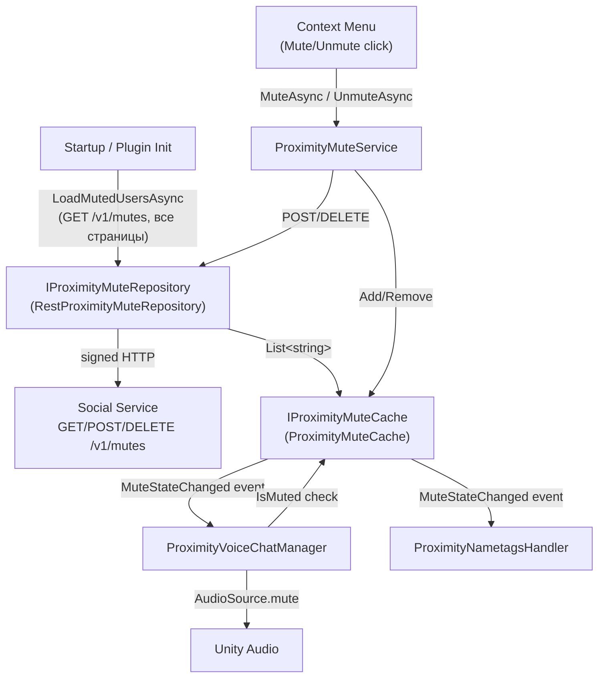

# Persistent Mute -- Plan

## Context

Persistence для proximity mute через HTTP REST API на Social Service.
Реализация идёт итеративно.

**ADR:** [ADR_mute_persistence.md](ADR_mute_persistence.md)

---

## Iteration 1: REST Repository + Cache + Startup Load

**Status:** Planned

Минимальная реализация: загрузка мьютов при старте, CRUD через API, in-memory кэш.

### Архитектура



### Что делать

#### 1. DTO (response models)

Создать `Assets/DCL/VoiceChat/Proximity/MutePersistence/DTOs/`:

```csharp
// MutedUserDto.cs
[Serializable]
public struct MutedUserDto
{
    public string address;
}

// GetMutesResponseDto.cs
[Serializable]
public struct GetMutesResponseDto
{
    public MutedUserDto[] mutes;
    public PaginationDto pagination;
}

// PaginationDto.cs
[Serializable]
public struct PaginationDto
{
    public int offset;
    public int limit;
    public int total;
}

// MuteRequestDto.cs
[Serializable]
public struct MuteRequestDto
{
    public string address;
}
```

> Точные поля уточнить по документации API. Структуры адаптировать после первого успешного запроса.

#### 2. IProximityMuteRepository (интерфейс)

Создать `Assets/DCL/VoiceChat/Proximity/MutePersistence/IProximityMuteRepository.cs`:

```csharp
public interface IProximityMuteRepository
{
    /// Загружает все замьюченные адреса (пагинация внутри).
    UniTask<List<string>> GetAllMutedUsersAsync(CancellationToken ct);

    /// Мьютит пользователя на сервере.
    UniTask MuteUserAsync(string walletAddress, CancellationToken ct);

    /// Снимает мьют на сервере.
    UniTask UnmuteUserAsync(string walletAddress, CancellationToken ct);
}
```

#### 3. RestProximityMuteRepository (реализация)

Создать `Assets/DCL/VoiceChat/Proximity/MutePersistence/RestProximityMuteRepository.cs`:

**Зависимости:**
- `IWebRequestController` — signed HTTP запросы
- `IDecentralandUrlsSource` — base URL для Social Service mutes endpoint

**Реализация:**
- `GetAllMutedUsersAsync`: цикл пагинации `GET /v1/mutes?offset=N&limit=M` пока не загрузит все
- `MuteUserAsync`: `POST /v1/mutes` с телом `{ "address": "0x..." }`
- `UnmuteUserAsync`: `DELETE /v1/mutes` с телом `{ "address": "0x..." }`
- Использовать `SignedFetchGetAsync`, `SignedFetchPostAsync`, `SignedFetchDeleteAsync`
- Паттерн: аналогично `CommunitiesDataProvider`

#### 4. IProximityMuteCache (интерфейс)

Создать `Assets/DCL/VoiceChat/Proximity/MutePersistence/IProximityMuteCache.cs`:

```csharp
public interface IProximityMuteCache
{
    event Action<string, bool>? MuteStateChanged;

    bool IsMuted(string walletAddress);
    void SetMuted(string walletAddress, bool muted);
    void Reset(IEnumerable<string> mutedAddresses);
}
```

#### 5. ProximityMuteCache (реализация)

Создать `Assets/DCL/VoiceChat/Proximity/MutePersistence/ProximityMuteCache.cs`:

- `HashSet<string>` (как текущий `ProximityMuteService`)
- `Reset()` — очищает и заполняет из переданного списка
- `SetMuted()` — add/remove + fire event
- `IsMuted()` — lookup

#### 6. Рефакторинг ProximityMuteService

Текущий `ProximityMuteService` становится фасадом:

```csharp
public class ProximityMuteService
{
    private readonly IProximityMuteCache cache;
    private readonly IProximityMuteRepository repository;

    // Sync check — для ProximityVoiceChatManager, ProximityNametagsHandler
    public bool IsMuted(string walletId) => cache.IsMuted(walletId);

    // Event passthrough
    public event Action<string, bool>? MuteStateChanged;

    // Async mute/unmute — для Context Menu
    public async UniTaskVoid MuteAsync(string walletId, CancellationToken ct)
    {
        await repository.MuteUserAsync(walletId, ct);
        cache.SetMuted(walletId, true);
    }

    public async UniTaskVoid UnmuteAsync(string walletId, CancellationToken ct)
    {
        await repository.UnmuteUserAsync(walletId, ct);
        cache.SetMuted(walletId, false);
    }

    // Startup load
    public async UniTask LoadAsync(CancellationToken ct)
    {
        List<string> muted = await repository.GetAllMutedUsersAsync(ct);
        cache.Reset(muted);
    }
}
```

**Важно:** `ToggleMute()` и `SetMuted(walletId, bool)` сохранить для обратной совместимости с текущими вызовами из контекстного меню, но внутри они должны вызывать async API.

#### 7. Регистрация URL

Добавить endpoint в `IDecentralandUrlsSource` / `DecentralandUrl` enum:

```csharp
SocialServiceMutes  // → {socialServiceBaseUrl}/v1/mutes
```

Проверить как другие Social Service HTTP endpoints зарегистрированы. Возможно, base URL уже есть и нужно только добавить path.

#### 8. DI / Plugin Wiring

В `DynamicWorldContainer` (или соответствующем контейнере):

```csharp
var muteRepo = new RestProximityMuteRepository(webRequestController, urlsSource);
var muteCache = new ProximityMuteCache();
var proximityMuteService = new ProximityMuteService(muteCache, muteRepo);
```

#### 9. Startup Load

Варианты загрузки при старте:

**A. В `VoiceChatPlugin.InjectToWorld()` (предпочтительно):**
```csharp
await proximityMuteService.LoadAsync(ct);
```

**B. Отдельная Startup Operation (аналог `BlocklistCheckStartupOperation`):**
Если загрузка должна блокировать дальнейшую инициализацию.

Вариант A проще и достаточен — мьюты нужны только для proximity voice chat.

#### 10. Обновление Context Menu

В `GenericUserProfileContextMenuController`:
- `OnMuteProximityClicked` → вызвать `proximityMuteService.MuteAsync(userId, ct)`
- `OnUnmuteProximityClicked` → вызвать `proximityMuteService.UnmuteAsync(userId, ct)`
- Обработать ошибки API (показать notification при неудаче)
- Optimistic update: обновить кнопку сразу, откатить при ошибке (опционально)

### Файловая структура

```
Assets/DCL/VoiceChat/Proximity/
├── MutePersistence/
│   ├── DTOs/
│   │   ├── MutedUserDto.cs
│   │   ├── GetMutesResponseDto.cs
│   │   ├── PaginationDto.cs
│   │   └── MuteRequestDto.cs
│   ├── IProximityMuteRepository.cs
│   ├── IProximityMuteCache.cs
│   ├── RestProximityMuteRepository.cs
│   └── ProximityMuteCache.cs
├── ProximityMuteService.cs              ← рефакторинг: фасад над cache + repository
├── ProximityVoiceChatManager.cs         ← без изменений (использует IsMuted + MuteStateChanged)
├── ProximityNametagsHandler.cs          ← без изменений
└── ...
```

### Error Handling

- `LoadAsync` при старте: log warning через `ReportHub`, продолжить без кэша (graceful degradation)
- `MuteAsync` / `UnmuteAsync`: log error, не обновлять кэш при ошибке API
- Сетевые ошибки не должны крашить приложение — мьют работает локально даже без API

### Тестирование

- Unit-тест `ProximityMuteCache`: Reset, SetMuted, IsMuted, events
- Unit-тест `ProximityMuteService`: LoadAsync заполняет кэш, MuteAsync/UnmuteAsync вызывают repo + cache
- Mock `IProximityMuteRepository` через NSubstitute
- Integration-тест (опционально): реальный HTTP запрос к zone/staging API

---

## Iteration 2 (Future): Refresh при Realm Change

**Status:** Not planned

Расширение до Варианта 3 (Hybrid) при необходимости.

### Scope

- При realm change (Stop → Restart rooms) вызвать `proximityMuteService.LoadAsync()` повторно
- Подписаться на событие realm change или `OnConnectionUpdated(Connected)` в Island Room
- Актуализирует кэш после realm switch без рестарта приложения

### Когда реализовывать

- Если появится потребность в multi-device sync
- Если пользователи жалуются на устаревшие мьюты после долгих сессий
