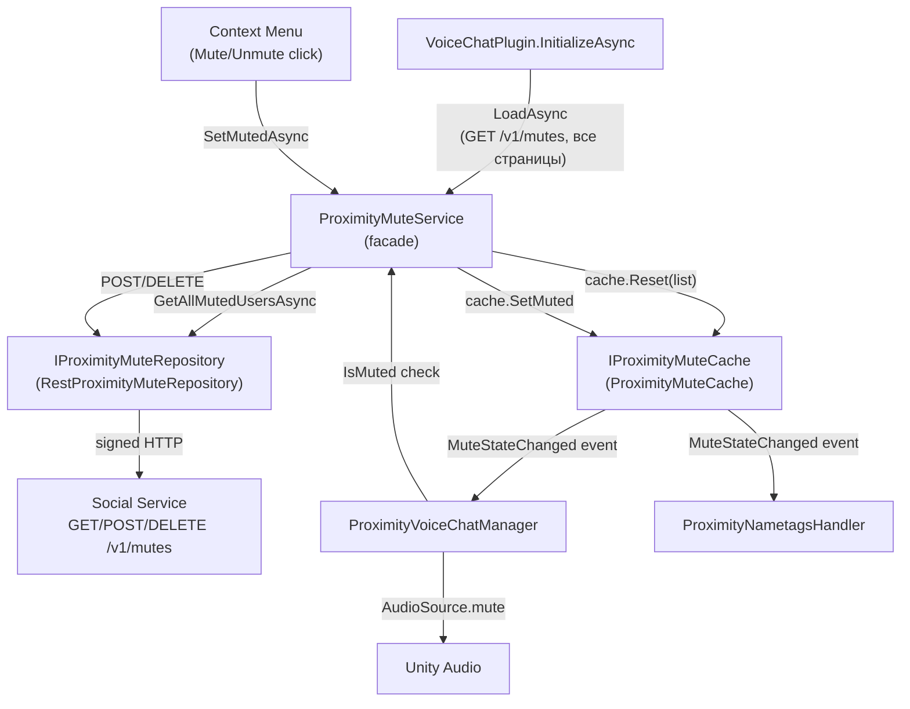

# Persistent Mute -- Plan

## Context

Persistence для proximity mute через HTTP REST API на Social Service.
Реализация идёт итеративно.

**ADR:** [ADR_mute_persistence.md](ADR_mute_persistence.md)

---

## Iteration 1: REST Repository + Cache + Startup Load

**Status:** Implemented

Загрузка мьютов при старте, CRUD через API, in-memory кэш.

### Архитектура

### Реализованные файлы

#### Новые файлы

| Файл | Назначение |
|------|-----------|
| `MutePersistence/GetMutesResponse.cs` | DTO ответа `GET /v1/mutes` — вложенная структура `data.results[].address`, пагинация `data.total/limit/offset` |
| `MutePersistence/MuteRequestBody.cs` | DTO тела `POST/DELETE /v1/mutes` — `{ "muted_address": "0x..." }` |
| `MutePersistence/IProximityMuteRepository.cs` | Интерфейс транспортного слоя (API). Три метода: `GetAllMutedUsersAsync`, `MuteUserAsync`, `UnmuteUserAsync` |
| `MutePersistence/RestProximityMuteRepository.cs` | HTTP-реализация через `IWebRequestController` + `SignedFetch*`. Пагинация GET в цикле (PAGE_SIZE=100). POST/DELETE через `WithNoOpAsync()` (204 No Content) |
| `MutePersistence/IProximityMuteCache.cs` | Интерфейс in-memory кэша: `IsMuted`, `SetMuted`, `Reset`, `MuteStateChanged` event |
| `MutePersistence/ProximityMuteCache.cs` | `HashSet<string>` (OrdinalIgnoreCase). `SetMuted` fire'ит event только при фактическом изменении |

#### Изменённые файлы

| Файл | Изменение |
|------|-----------|
| `ProximityMuteService.cs` | Рефакторинг: из самостоятельного сервиса в фасад над `IProximityMuteCache` + `IProximityMuteRepository`. Новые методы: `LoadAsync(ct)`, `SetMutedAsync(walletId, muted, ct)`. Синхронные `SetMuted` и `ToggleMute` сохранены для обратной совместимости (local-only). `MuteStateChanged` — passthrough с кэша |
| `DecentralandUrl.cs` | Добавлен `SocialServiceMutes = 84` |
| `DecentralandUrlsSource.cs` | Маппинг: `SocialServiceMutes → https://social-api.decentraland.{ENV}/v1/mutes` |
| `SignedWebRequestControllerExtensions.cs` | Новый overload `SignedFetchDeleteAsync` с `GenericPostArguments` (body) — DELETE API мьютов требует body `{ "muted_address": "..." }` |
| `DynamicWorldContainer.cs` | Wiring: `ProximityMuteCache` + `RestProximityMuteRepository` → `ProximityMuteService(cache, repo)` |
| `VoiceChatPlugin.cs` | `await proximityMuteService.LoadAsync(ct)` в `InitializeAsync` перед созданием proximity-менеджеров |
| `GenericUserProfileContextMenuController.cs` | `OnMuteProximityClicked` / `OnUnmuteProximityClicked` → async `MuteProximityAsync` → `SetMutedAsync` через API |

#### Нетронутые файлы

| Файл | Почему |
|------|--------|
| `ProximityVoiceChatManager.cs` | Использует только `IsMuted()` + `MuteStateChanged` — публичный контракт не изменился |
| `ProximityNametagsHandler.cs` | Аналогично — подписка на `MuteStateChanged` и `IsMuted()` |

### Ключевые решения

**Repository vs Cache:**
- **Repository** = транспорт (как общаться с API: HTTP, signed fetch, пагинация, сериализация)
- **Cache** = состояние (что замьючено: O(1) lookup, events для подписчиков)
- **Service** = фасад-координатор (API call → при успехе → обновить кэш)

**DELETE с body:**
Существующий `SignedFetchDeleteAsync` передавал `GenericPostArguments.Empty`. Добавлен overload с `GenericPostArguments` аргументом. `GenericDeleteRequest` поддерживает body, т.к. внутренне использует `GenericPostRequest.CreateWebRequest` + метод "DELETE".

**Cancellation:**
Согласно code standards проекта: `ct.IsCancellationRequested` + return (не `ThrowIfCancellationRequested`), `OperationCanceledException` игнорируется (не re-throw).

**Error handling:**
- `LoadAsync` при старте: log warning, продолжить без кэша (graceful degradation)
- `SetMutedAsync`: log error, кэш НЕ обновляется при ошибке API
- Сетевые ошибки не крашат приложение

### Тестирование

- Unit-тест `ProximityMuteCache`: Reset, SetMuted, IsMuted, events
- Unit-тест `ProximityMuteService`: LoadAsync заполняет кэш, SetMutedAsync вызывает repo + cache
- Mock `IProximityMuteRepository` через NSubstitute
- Integration-тест (опционально): реальный HTTP запрос к zone/staging API

---

## Iteration 2 (Future): Refresh при Realm Change

**Status:** Not planned

Расширение до Варианта 3 (Hybrid) при необходимости.

### Scope

- При realm change (Stop → Restart rooms) вызвать `proximityMuteService.LoadAsync()` повторно
- Подписаться на событие realm change или `OnConnectionUpdated(Connected)` в Island Room
- Актуализирует кэш после realm switch без рестарта приложения

### Когда реализовывать

- Если появится потребность в multi-device sync
- Если пользователи жалуются на устаревшие мьюты после долгих сессий
