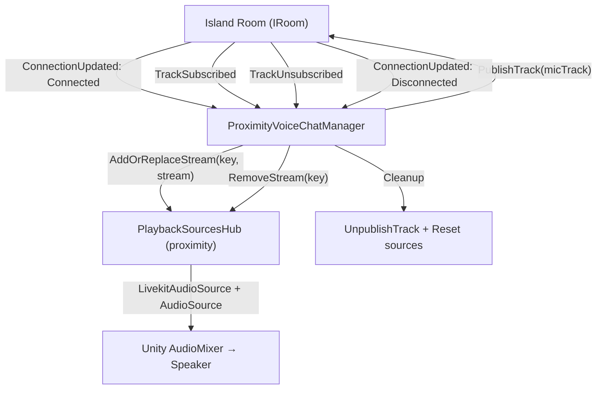

# Proximity Voice Chat -- План реализации

## Контекст

Нужен Spatial Nearby Voice Chat, который включён по дефолту и использует участников Island Room. Реализация идёт итеративно.

---

## Итерация 1: Базовый прототип (без 3D audio)

### Выбранный подход: Вариант A -- публикация аудио в Island Room

Island Room -- уже подключённая LiveKit-комната, в которой находятся все участники по близости. `IRoom` поддерживает `AudioStreams`, `AudioTracks`, `PublishTrack`. Не нужна новая комната, новый connection string, никакой координации с BE.

**Проверено:** LiveKit-сервер разрешает публикацию аудио-треков в Island Room (тест `ProximityVoiceChatTest` пройден успешно).

### Что делаем

Создаём `ProximityVoiceChatManager` и подключаем в `VoiceChatPlugin`:

1. Слушает `ConnectionUpdated` на Island Room
2. При подключении -- создаёт `MicrophoneRtcAudioSource`, публикует аудио-трек в Island Room
3. Подписывается на `TrackSubscribed`/`TrackUnsubscribed` на Island Room
4. Проигрывает remote audio через `PlaybackSourcesHub` (свой отдельный экземпляр)
5. При отключении Island -- cleanup

Работает полностью параллельно существующему voice chat, не трогает Orchestrator.

### Файлы

| Действие | Файл |
|----------|------|
| Создать | `Assets/DCL/VoiceChat/ProximityVoiceChatManager.cs` |
| Изменить | `Assets/DCL/PluginSystem/Global/VoiceChatPlugin.cs` |
| Изменить | `Assets/DCL/VoiceChat/VoiceChatConfiguration.cs` |

### Архитектура



### Ключевой код

Публикация:
```csharp
MicrophoneRtcAudioSource rtcAudioSource = MicrophoneRtcAudioSource.New(...);
rtcAudioSource.Start();
ITrack track = islandRoom.AudioTracks.CreateAudioTrack(name, rtcAudioSource);
islandRoom.Participants.LocalParticipant().PublishTrack(track, options, ct);
```

Приём:
```csharp
Weak<AudioStream> stream = islandRoom.AudioStreams.ActiveStream(new StreamKey(identity, sid));
playbackSourcesHub.AddOrReplaceStream(key, stream);
```

### Что НЕ делаем в итерации 1

- Не трогаем `VoiceChatOrchestrator` / `VoiceChatType`
- Не делаем 3D audio (spatialBlend)
- Не делаем UI для proximity
- Не делаем mute/unmute proximity при Private/Community звонке
- Не делаем reconnection logic (Island Room сам reconnect-ится)
- Не делаем BE координацию

### Оценка

- **1 новый файл** (~150-200 строк)
- **2 файла** с минимальными правками
- **Время**: 2-4 часа

---

## Итерация 2: 3D Spatial Audio (планируется)

- `AudioSource.spatialBlend = 1`
- Настройка `minDistance`, `maxDistance`, `rolloffMode`
- Обновление позиции каждого `LivekitAudioSource` по позиции аватара через `EntityParticipantTable` → Entity → Transform
- Потребуется ECS-система или polling для обновления позиций каждый кадр

## Итерация 3: Интеграция с Orchestrator (планируется)

- Добавить `VoiceChatType.SPATIAL` в enum
- Интегрировать с `VoiceChatOrchestrator` для координации с Private/Community
- Mute/unmute spatial при активных звонках
- UI toggle для включения/выключения proximity

---

## Отвергнутые варианты

### Вариант B: Отдельная комната с тем же connection string

- Изолирует аудио от data-трафика
- Но: тот же токен вызовет `DuplicateIdentity` disconnect
- Значительно сложнее

### Вариант C: Новый серверный endpoint

- Аналог community voice chat но с auto-join
- Требует BE разработки
- Overkill для прототипа
