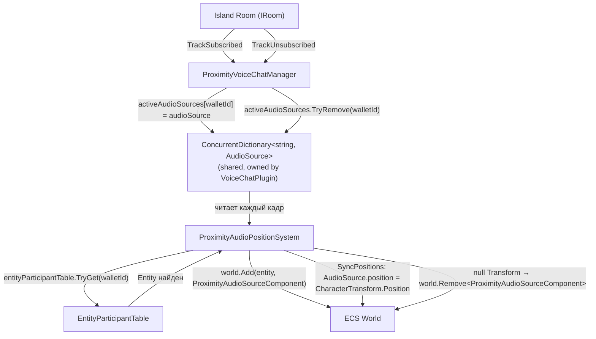

# Proximity Voice Chat -- План реализации

## Контекст

Нужен Spatial Nearby Voice Chat, который включён по дефолту и использует участников Island Room. Реализация идёт итеративно.

---

## Итерация 1: Базовый прототип (без 3D audio) ✓

**Статус:** Завершена

### Выбранный подход: Вариант A -- публикация аудио в Island Room

Island Room -- уже подключённая LiveKit-комната, в которой находятся все участники по близости. `IRoom` поддерживает `AudioStreams`, `AudioTracks`, `PublishTrack`. Не нужна новая комната, новый connection string, никакой координации с BE.

**Проверено:** LiveKit-сервер разрешает публикацию аудио-треков в Island Room (тест `ProximityVoiceChatTest` пройден успешно).

### Что сделано

Создан `ProximityVoiceChatManager`, подключён в `VoiceChatPlugin`:

1. Слушает `ConnectionUpdated` на Island Room
2. При подключении -- создаёт `MicrophoneRtcAudioSource`, публикует аудио-трек в Island Room
3. Подписывается на `TrackSubscribed`/`TrackUnsubscribed` на Island Room
4. Создаёт spatial `LivekitAudioSource` для каждого remote-участника
5. При отключении Island -- cleanup

Работает полностью параллельно существующему voice chat, не трогает Orchestrator.

---

## Итерация 2: 3D Spatial Audio ✓

**Статус:** Завершена

### Что сделано

Реализовано 3D-позиционирование аудио через ECS-систему. Менеджер управляет жизненным циклом аудио (LiveKit), система управляет привязкой к entity и синхронизацией позиций.

### Архитектура



### Файлы

| Действие | Файл |
|----------|------|
| Создать | `Assets/DCL/VoiceChat/Proximity/Systems/ProximityAudioPositionSystem.cs` |
| Создать | `Assets/DCL/VoiceChat/Proximity/Systems/ProximityLipSyncSystem.cs` |
| Создать | `Assets/DCL/VoiceChat/Proximity/ProximityAudioSourceComponent.cs` |
| Создать | `Assets/DCL/VoiceChat/Proximity/ProximityLipSyncComponent.cs` |
| Изменить | `Assets/DCL/VoiceChat/Proximity/ProximityVoiceChatManager.cs` |
| Изменить | `Assets/DCL/PluginSystem/Global/VoiceChatPlugin.cs` |

### Ключевые решения

**Shared Dictionary как мост между Manager и ECS:**
- `VoiceChatPlugin` владеет `ConcurrentDictionary<string, AudioSource>`
- Менеджер пишет (walletId → AudioSource) при subscribe/unsubscribe
- Система читает словарь каждый кадр и назначает/снимает компоненты

**Почему не прямой `world.Add` в менеджере:**
- Entity может ещё не существовать на момент `OnTrackSubscribed` (LiveKit-событие приходит раньше, чем `MultiplayerProfilesSystem` создаёт entity)
- Система каждый кадр пробует `entityParticipantTable.TryGet()` — привяжет как только entity появится

**Cleanup через null-detection:**
- При `RemoveRemoteSource` менеджер убирает из словаря и уничтожает source
- Система в `ProcessCleanUp` детектит null Transform → собирает в cleanup-список → `world.Remove` после query

### Spatial Audio настройки

```csharp
spatialBlend = 1.0f           // полный 3D
dopplerLevel = 0f             // без doppler-эффекта
rolloffMode = Custom          // с ProximityCustomRolloffCurve
minDistance = 2f
maxDistance = 16f
spread = 0f
ILDMode = HeadShadow          // interaural level difference
enableITD = false             // interaural time delay
enableHRTF = false            // pinna filtering
```

## Итерация 3: Полноценная интеграция ✓

**Статус:** Завершена

> Детальный анализ каждой фичи — см. `ANALYSIS_voicechat_features.md`

### 3.1 Nametag speaking indicator ✓

`ProximityNametagsHandler` — подписка на `islandRoom.ActiveSpeakers.Updated`, `entityParticipantTable.TryGet()` → `world.AddOrSet(entity, VoiceChatNametagComponent)`. Поддержка `IsHushed` для мьютнутых участников. Suppression при Private/Community call.

### 3.2 Mute/Unmute + Push-to-Talk ✓

- `ProximityVoiceChatStateModel` с состояниями Disconnected/Hearing/Speaking/Blocked
- `NearbyVoiceWidgetController` с PTT через `DCLInput.VoiceChat.Talk`
- `rtcAudioSource.Stop()/Start()` при переходах Speaking ↔ Hearing
- Lazy track publishing: публикация при первом Speaking (см. `ADR_lazy_track_publishing.md`)

### 3.3 Смена микрофона в рантайме ✓

Подписка на `VoiceChatSettings.MicrophoneChanged` → `rtcAudioSource.SwitchMicrophone()` в `ProximityVoiceChatManager`.

### 3.4 Mute proximity при Private/Community call ✓

Подписка на `callStatus` → `stateModel.Suppress()` / `stateModel.Resume()`. State model запоминает pre-blocked state (включая Speaking).

### 3.5 Звуковой фидбек mute/unmute

**Статус:** Не реализован

### 3.6 macOS permissions guard ✓

`VoiceChatPermissions.GuardAsync()` перед `MicrophoneRtcAudioSource.New()` на macOS.

### 3.7 Reconnection retry ✓

`ActivateWithRetryAsync` с `MaxReconnectionAttempts` (default 3) и `ReconnectionDelayMs` (default 2000ms).

### 3.8 Mute persistence ✓

**Не было в исходном плане.**

- `ProximityMuteService` — фасад над кэшем и REST API
- `ProximityMuteCache` — in-memory HashSet с case-insensitive сравнением
- `RestProximityMuteRepository` — REST API (`SocialServiceMutes`), пагинация по 100
- Мьют пропагируется в `ProximityVoiceChatManager` (глушит AudioSource) и `ProximityNametagsHandler` (IsHushed)

### 3.9 Lip sync ✓

**Не было в исходном плане.**

- `ProximityLipSyncSystem` (ECS, after `ProximityAudioPositionSystem`)
- `ProximityLipSyncComponent` — хранит renderer, LivekitSource, текущий pose index
- 3 режима: AmplitudeWeighted, SpeechBandAmplitude, FrequencyBands (default)
- 16 поз из `Mouth_Atlas.png` (4×4), разбиты на группы (slight/medium/wide/vowel/sibilant)
- Настройки в `VoiceChatConfiguration`: sensitivity, smoothing, silence threshold, band frequencies

### 3.10 UI ✓

**Не было в исходном плане.**

- `ProximityVoiceChatButtonController` + `ProximityVoiceChatButtonView` — кнопка в sidebar с индикатором состояния
- `NearbyVoiceWidgetController` + `NearbyVoiceWidgetView` — панель с hear toggle, volume slider, speak button
- `NearbyVoicePanelController` — MVC controller для popup-панели
- Prefabs: `NearbyVoice.Button.prefab`, `NearbyVoice.Widget.prefab`

### 3.11 Debug widget ✓

**Не было в исходном плане.**

`ProximityAudioDebugWidget` — runtime-слайдеры для spatial blend, doppler, min/max distance, spread, rolloff mode. Привязка через `ElementBinding<float>` к `ProximityConfigHolder`.

### 3.12 Мьют заблокированных игроков (social block)

**Статус:** Не реализовано  
**Приоритет:** Средний

Игроки, заблокированные через Block User в контекстном меню профиля, должны быть автоматически замьючены в proximity voice chat. Текущий `ProximityMuteService` работает только с proximity-специфичным мьютом — нужно также учитывать глобальный social block.

---

## Отвергнутые варианты

### Вариант B: Отдельная комната с тем же connection string

- Изолирует аудио от data-трафика
- Но: тот же токен вызовет `DuplicateIdentity` disconnect
- Значительно сложнее

### Вариант C: Новый серверный endpoint

- Аналог community voice chat но с auto-join
- Требует BE разработки
- Overkill для прототипа
