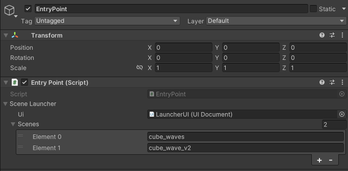
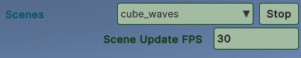

# unity-explorer

Explorer renderer 

## Submodule installation required

After checking out, remember to install and update the submodules by doing (git submodule update --init and git submodule update .)

# Protocol Generation
## Update protocol

To update the protocol to the last version of the protocol, you can execute the following commands:
```
cd scripts
npm install @dcl/protocol@next
npm run build-protocol
```

## SDK7 Integration Progress

### Components

## In Progress
- [ ] `Animator`
- [ ] `PointerLock`
- [ ] `AvatarAttach`
- [ ] `AvatarModifierArea`
- [ ] `CameraMode`
- [ ] `CameraModeArea`

## Completed
- [x] `AudioSource`
- [x] `AudioStream`
- [x] `AvatarShape`
- [x] `Billboard`

- [x] `EngineInfo`
- [x] `GltfContainer`
- [x] `GltfContainerLoadingState`
- [x] `Material`
- [x] `MeshCollider`
- [x] `MeshRenderer`
- [x] `Name`
- [x] `NftShape`
- [x] `PointerEvents`
- [x] `PointerEventsResult`
- [x] `Raycast`
- [x] `RaycastResult`
- [x] `TextShape`
- [x] `Transform`
- [x] `Tween`
- [x] `TweenSequence`
- [x] `TweenState`
- [x] `UiBackground`
- [x] `UiCanvasInformation`
- [x] `UiDropdown`
- [x] `UiDropdownResult`
- [x] `UiInput`
- [x] `UiInputResult`
- [x] `UiText`
- [x] `UiTransform`
- [x] `VideoEvent`
- [x] `VideoPlayer`
- [x] `VisibilityComponent`

## Runtime API

## In Progress
- [ ] `CommsApi`
- [ ] `CommunicationsController`
- [ ] `EnvironmentApi`
- [ ] `Players`
- [ ] `PortableExperiences`
- [ ] `RestrictedActions`
- [ ] `Scene`
- [ ] `Testing`
- [ ] `UserActionModule`
- [ ] `UserIdentity`

## Completed

- [x] `SignedFetch`
- [x] `Runtime`
- [x] `EngineApi`
- [x] `EthereumController`

## Regenerate protocol

Just run:
```
cd scripts
npm run build-protocol
```

# Test scenes
## Add a new scene
To be able to select the scene at runtime
- Place it to the "StreamingAssets\Scenes" directory.
- Add its name without an extension to the "Scenes" list on the `EntryPoint` component.



## Control scene lifecycle



At the moment one scene can be active at a time. By default at startup no scene is launched.

- When a new scene is selected, the old scene is unloaded releasing its components to the pool. 
- "Stop" just disposes the scene
- You can easily notice if the resources are not properly disposed by looking at the Unity hierarchy.
- Setting the framerate can be useful for a stress test.
