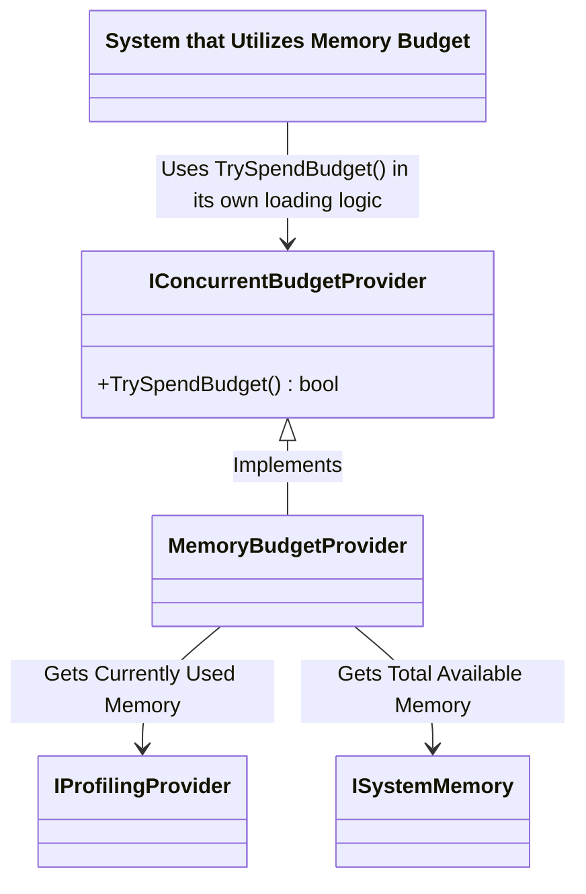
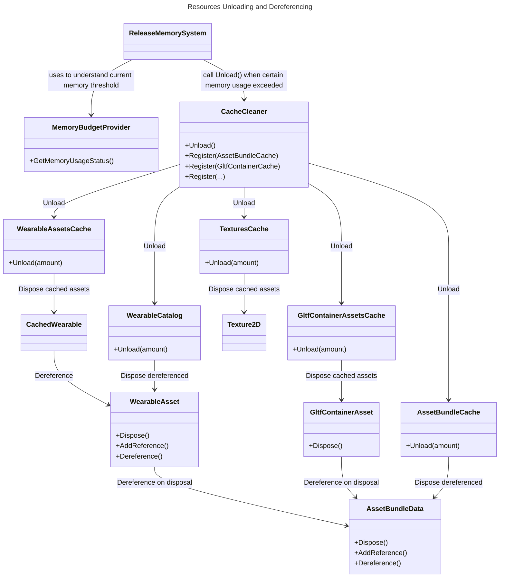

# Memory Budgeting & Resource Unloading

Memory budgeting in Unity is crucial for maintaining system stability and preventing memory overflows and crashes. By keeping memory usage within predetermined limits, it ensures smooth application performance across various platforms, each with their different hardware capacities. This strategy also aids in efficient resource management, allowing for strategic decisions regarding asset loading and unloading.

The central component of the memory budgeting system in the project is `MemoryBudgetProvider`. This provider offers insights into the current memory usage relative to the total system memory. It has the following dependencies:
1. `IProfilingProvider`: Provides information about current memory usage by reading from Unity's built-in `ProfilerRecorder`.
2. `ISystemMemory`: Offers details about the total available system memory. Polymorphism is used to access data on different devices.
3. `MemoryBudgetProvider` implements `IConcurrentBudgetProvider` and uses data from `IProfilingProvider` to gauge its relationship to the total system memory from `ISystemMemory`, correlating it with the respective threshold. It returns false for `TrySpendBudget()` calls if the memory usage reaches the Full threshold (defined in settings as a certain percentage of total system memory).

### Usage in Loading Scenarios

Similar to other budget providers, `MemoryBudgetProvider` is utilized by different systems that could potentially lead to increased memory consumption. These systems halt the loading process when the budget cannot be spent. Examples include `CreateGltfAssetFromAssetBundleSystem` and `DeferredLoadingSystem`.

## Resources Unloading
In situations where memory consumption nears or exceeds critical levels, it becomes essential to reduce this pressure by strategically unloading resources that are no longer necessary. The goal of resource unloading is to free up memory space for new or more relevant resources needed for the current user experience. This is achieved through several components:

1. **`ReleaseMemorySystem`**: Continuously monitors memory usage (provided by `MemoryBudgetProvider`). When usage reaches or surpasses a predefined threshold, it activates the resource unloading process. This process prioritizes the unloading of resources with minimal impact on the user experience or those that can be reloaded as needed. Currently, it focuses on clearing resource-intensive caches and pools through the `CacheCleaner` class.
2. **`CacheCleaner`**: This class encapsulates the logic for resource clearance using a visitor pattern, where different caches and pools are registered. Upon activation by `ReleaseMemorySystem`, `CacheCleaner` unloads registered pools and caches in a specific sequence and chunk sizes.
3. **Disposal in Pools and Caches**: Each pool and cache is designed with unloading functionalities. Caches use an LRU-based approach for identifying and unloading less needed items, typically employing a `PriorityQueue`. Pools, derived from Unity's standard pools, extend it with a chunk-based clearance method. All unloading operations are conducted within the constraints of FrameTime budgeting to ensure efficient performance. Unloading initiates the disposal of respective assets.

**Note:**  Current unloading is straightforward and effective, but there is potential for future enhancements. These could include more advanced strategies or dynamic adjustments to better accommodate changing system demands, as well as different clearance strategies for varying memory usage thresholds.

Below is a simplified class diagram of the Resources Unloading process, highlighting the main elements of this system. A critical aspect of this process is the proper dereferencing of dependent assets.

## Debug and Profiling
There are several tools that help to debug and profile this process.

### Profiling Counters and Markers
- Mentioned resources and their amount in caches is measured by profiling counters, that can be selected in custom profiling module. Read [Viewing the counters in the Profiler Window](https://docs.unity3d.com/Packages/com.unity.profiling.core@1.0/manual/profilercounter-guide.html) on the official package page for more details.

- `Update` call of each ECS System is covered by the respective profiling marker, so it is easy to find `ReleaseMemorySystem` by name in the recorded data of the CPU profiling module.

### Debug view
Debug panel is supported by information about currently used memory and 2 thresholds (WARNING and FULL), as well as buttons to simulate respective memory usage.

### Tests
For getting more insights on how referencing/dereferencing works in isolated environment, please refer to the `CacheCleanerIntegrationTests`.

## Further Improvements

As mentioned earlier, the current system is a work in progress and has room for several enhancements:

- **Expansion of Pool Types**: At present, the system does not include pools for Transforms, Colliders, Primitives, and similar components. Incorporating these elements could further optimize memory management.
- **Heavy DTO Cleanup**: Consideration for cleaning up heavy Data Transfer Objects (DTOs), particularly for Scenes and Wearables, can be additional improvements in memory usage.
- **AssetBundle Size Utilization**: Utilizing information about AssetBundle sizes can refine the memory release strategy. This improvement would require adjustments on the AssetBundleConverter side to be effective.
- **Advanced Unloading Strategies**: More sophisticated unloading strategies or dynamic adjustments could be implemented to better accommodate changing system demands. Additionally, developing different clearance strategies for varying memory usage thresholds could enhance the system's efficiency and responsiveness.
