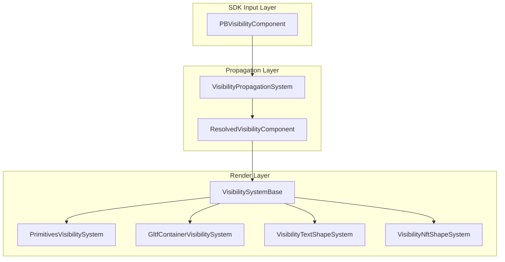
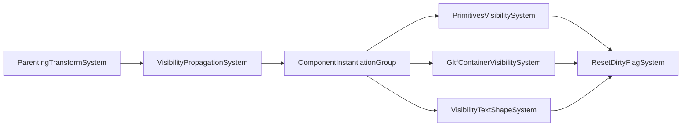

# Visibility Component Propagation

The SDK contains a component called VisibilityComponent (manual usage [here](https://docs.decentraland.org/creator/scenes-sdk7/3d-content-essentials/shape-components#make-invisible), protocol [here](https://github.com/decentraland/protocol/blob/experimental/proto/decentraland/sdk/components/visibility_component.proto)), that component allows creators to toggle the visibility of a specific Entity in its scene.

Since the introduction of the `PropagateToChildren` property for that component, certain rules start to apply in regards to visibility propagation.

## Visibility PropagateToChildren Implementation

Implementation PR: https://github.com/decentraland/unity-explorer/pull/6442

### Architecture Overview

### Priority Rules

1. Entity's own `PBVisibilityComponent` **always takes priority**
2. If no own component, inherit from nearest ancestor with `PropagateToChildren=true`
3. If no propagating ancestor, default to **visible (true)**
4. Visibility must be updated whenever hierarchy, parent component or own component changes

### Possible Scenarios (all covered in tests)

* Child has own `VisibilityComponent` -> Own component takes priority, skip in propagation
* Child's `VisibilityComponent` removed -> Re-inherit from parent hierarchy
* Child has own component + `propagateToChildren=TRUE` -> Child's propagation takes over for grandchildren (blocks ancestor)
* Child has own component + `propagateToChildren=FALSE` -> "Pass-through": grandchildren inherit from ancestor, not child
* Reparented under non-propagating hierarchy -> Reset to visible
* Reparented under propagating hierarchy (already had `ResolvedVisibility`) -> Inherit new parent's visibility
* Reparented under propagating hierarchy (never had `ResolvedVisibility`) -> Create `ResolvedVisibility` and inherit from new parent
* Reparented entity has children -> Propagate visibility to all descendants of reparented entity
* Reparented under pass-through parent -> Walk up hierarchy to find propagating ancestor
* Parent's `PBVisibilityComponent` removed -> Children reset to visible

https://github.com/user-attachments/assets/a7df88bf-b0e4-4049-9aee-b457ab19bd0b

### Relevant Code Elements

#### 1. New Component: `ResolvedVisibilityComponent`

Key fields:

- `ShouldPropagate` - When reparenting, check if new parent's resolved visibility should cascade
- `LastKnownParent` - Compare with `TransformComponent.Parent` to detect reparenting without modifying ParentingTransformSystem

#### 2. `VisibilityPropagationSystem`

**Must run AFTER `ParentingTransformSystem`** (so parent relationships are already updated)

##### Reparenting Detection Strategy

Use of `SDKTransform.IsDirty` as a filter to avoid checking every frame, this is efficient because:

1. `SDKTransform.IsDirty` filters to only entities with transform changes
2. Quick `LastKnownParent` comparison filters out position/rotation/scale-only changes
3. Only actual reparenting triggers visibility recomputation

#### 3. `VisibilitySystemBase`

- Query to use `ResolvedVisibilityComponent` (primary)
- Keep fallback to direct `PBVisibilityComponent` for backwards compatibility

### System Execution Order

Key ordering: `VisibilityPropagationSystem` must be `[UpdateAfter(typeof(ParentingTransformSystem))]` so parent relationships are established before we check for reparenting.
